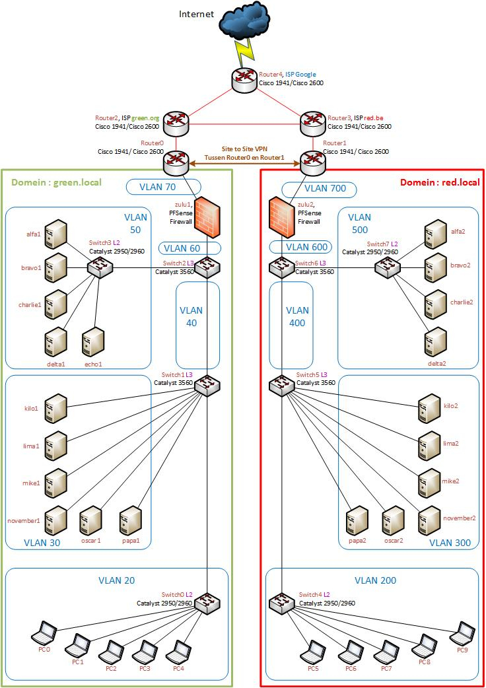

# p3ops-team-repo

## Taakverdeling teamleden

De kolom "Uitvoering" bevat de verantwoordelijke voor het realiseren van de taak, "Testen" is voor de verantwoordelijke voor de acceptatietests (schrijft dus testrapport). De naam van de verantwoordelijke is een link naar diens Github profielpagina, bv. [Bert Van Vreckem](https://github.com/bertvv/).

| Taak      | Uitvoering                                            | Testen                                          |
| :---      | :---                                                  | :---                                            |
| alfa2     | [Kimberly De Clercq](https://github.com/KimberlyDC)   [Laurens Blancquart-Cassaer](https://github.com/Laurensbc)   | [Alister Adutwum](https://github.com/AdutwumAlister)   [Sean Vancompernolle](https://github.com/SeanVancompernolle)      |
| bravo2    | [Levi Goessens](https://github.com/LeviGoessens)     [Arno Van Nieuwenhove](https://github.com/ArnoVanNieuwenhove) | [Cédric Detemmerman](https://github.com/CedricDT)   [Robby Daelman](https://github.com/RobbyDaelman)          |
| charlie2  | [Joachim Van de Keere](https://github.com/Joachimvdk)   [Jannes Van Wonterghem](https://github.com/JannesVanWonterghem)      | [Kimberly De Clercq](https://github.com/KimberlyDC)                           |
| delta2    | [Matthias Van de Velde](https://github.com/fpkmatthi)   [Nathan Cammerman](https://github.com/NathanCammerman)          | [Joachim Van de Keere](https://github.com/Joachimvdk)   [Jannes Van Wonterghem](https://github.com/JannesVanWonterghem) |
| kilo2     | [Yngvar Samyn](https://github.com/yngvar1)   [Tibo Vanhercke](https://github.com/TiboVanhercke)                   | [Matthias Van de Velde](https://github.com/fpkmatthi)    [Nathan Cammerman](https://github.com/NathanCammerman)    |
| lima2     | [Cédric Detemmerman](https://github.com/CedricDT)   [Robby Daelman](https://github.com/RobbyDaelman)              | [Aron Marckx](https://github.com/AronMarckx)   [Cédric Van den Eede](https://github.com/cevde)           |
| mike2     | [Tim Grijp](https://github.com/pikabooiseu)   [Elias Waterschoot](https://github.com/Elias-Waterschoot)| [Yngvar Samyn](https://github.com/yngvar1)   [Tibo Vanhercke](https://github.com/TiboVanhercke)        |
| november2 | [Aron Marckx](https://github.com/AronMarckx)   [Cédric Van den Eede](https://github.com/cevde) | [Levi Goessens](https://github.com/LeviGoessens)    [Arno Van Nieuwenhove](https://github.com/ArnoVanNieuwenhove) |
| oscar2    | [Rik Claeyssens](https://github.com/RikCl)   [Jonas Vandegehuchte](https://github.com/JonasVandegehuchte)             |  [Tim Grijp](https://github.com/pikabooiseu)   [Elias Waterschoot](https://github.com/Elias-Waterschoot)                   |
| papa2     | [Ferre Verstichelen](https://github.com/FerreVerstichelen)    [Laurens Blancquart-Cassaer](https://github.com/Laurensbc)  | [Jens Van Liefferinge](https://github.com/JensVL)   [Robin Van de Walle](https://github.com/RobinVandeWalle)   |
| zulu2     | [Alister Adutwum](https://github.com/AdutwumAlister)   [Sean Vancompernolle](https://github.com/SeanVancompernolle)   | [Ferre Verstichelen](https://github.com/FerreVerstichelen) |
| netwerk   | [Jens Van Liefferinge](https://github.com/JensVL)   [Robin Van de Walle](https://github.com/RobinVandeWalle)         | [Rik Claeyssens](https://github.com/RikCl)   [Jonas Vandegehuchte](https://github.com/JonasVandegehuchte)                               |
| release   | [Matthias Van de Velde](https://github.com/fpkmatthi)                                 |                                                 |
| gantt     | [Nathan Cammerman](https://github.com/NathanCammerman)   [Kimberly De Clercq](https://github.com/KimberlyDC)             |                                                 |

## Overzicht IP-adrestoewijzing
| Device    | Soort DNS record | IP-address | 
| :--:      | :--:             | :--:       | 
| alfa2     | NS               | 172.18.1.66| 
| bravo2    | NS               | 172.18.1.67| 
| charlie2  | A + MX + Cname   |172.18.1.68 | 
| delta2    | A                | 172.18.1.69| 
| kilo2     | A                | 172.18.1.1 | 
| lima2     | A                | 172.18.1.2 | 
| mike2     | A                | 172.18.1.3 | 
| november2 | A                | 172.18.1.4 | 
| oscar2    | A                | 172.18.1.5 | 
| papa2     | A                | 172.18.1.6 |

## Overzicht documentatie

## TODOs

- [ ] Overzichten in deze README
    - [ ] taakverdeling met verantwoordelijken
    - [ ] inhoudstafel documentatie
    - [ ] IP-adrestoewijzingen
- [ ] Directorystructuur
    - [ ] broncode met duidelijke, logische structuur
        - Linux: layout volgens [Ansible best practices](https://docs.ansible.com/ansible/latest/user_guide/playbooks_best_practices.html). Gebruik evt. <https://github.com/bertvv/ansible-skeleton> als basis.
    - [ ] documentatie
        - per deeltaak:
            - lastenboek
            - technische documentatie, incl. verslag opzoekwerk
            - testplannen en -rapporten
        - draaiboek productie-release
        - integratietestplannen
    - [ ] Verslagen stand-ups en ander overleg
