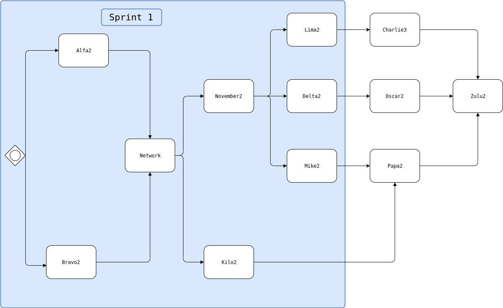

# Release environment

## Releases

* TODO: put release tag here [vx.x.x](link/to/release-tag)

## Critical path

You can edit the file by going to [draw.io](https://www.draw.io).
1. Start an empty diagram
2. Go to File > Import from > Device
3. Select the file from docs/Critical_path.drawio

## Integration strategy

* Sprint 1 -- [Full guide](docs/intergration-strategy.md)
