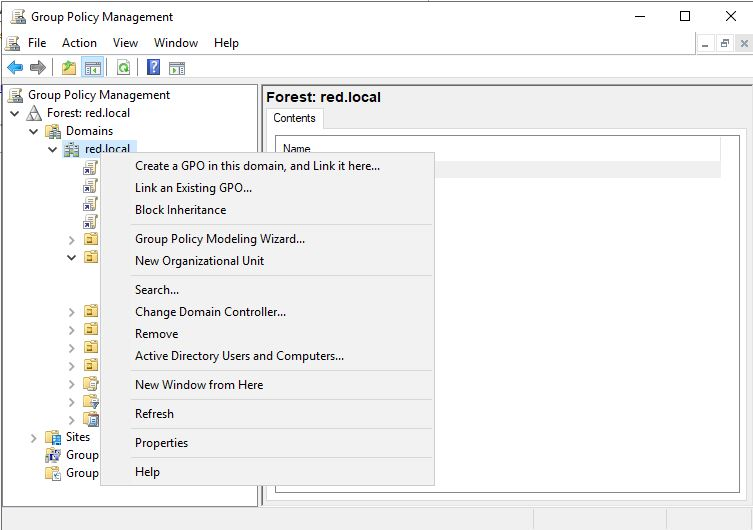
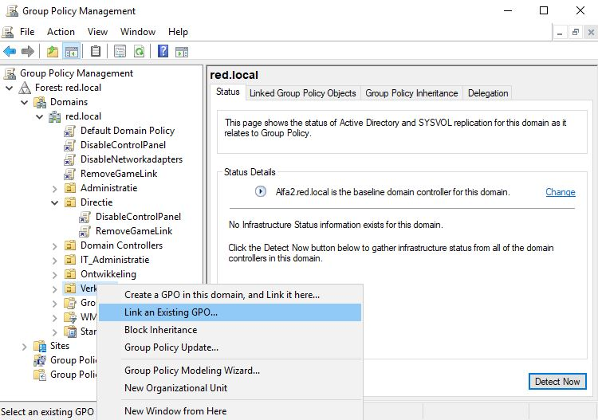
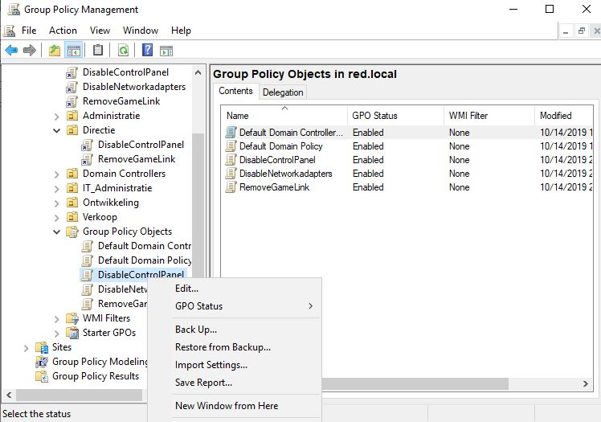
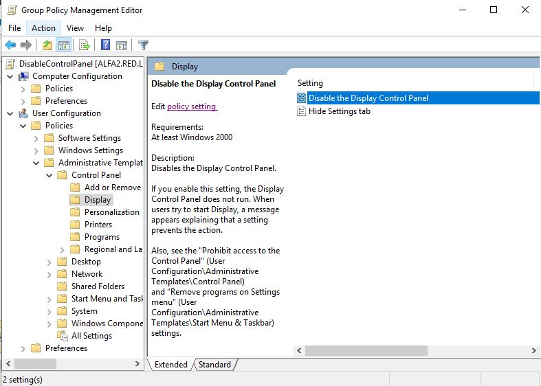
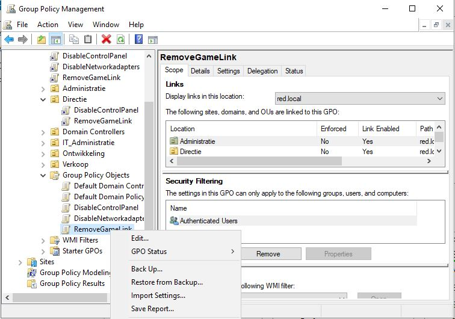
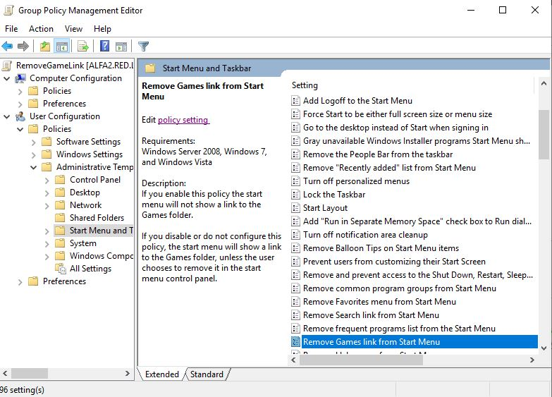
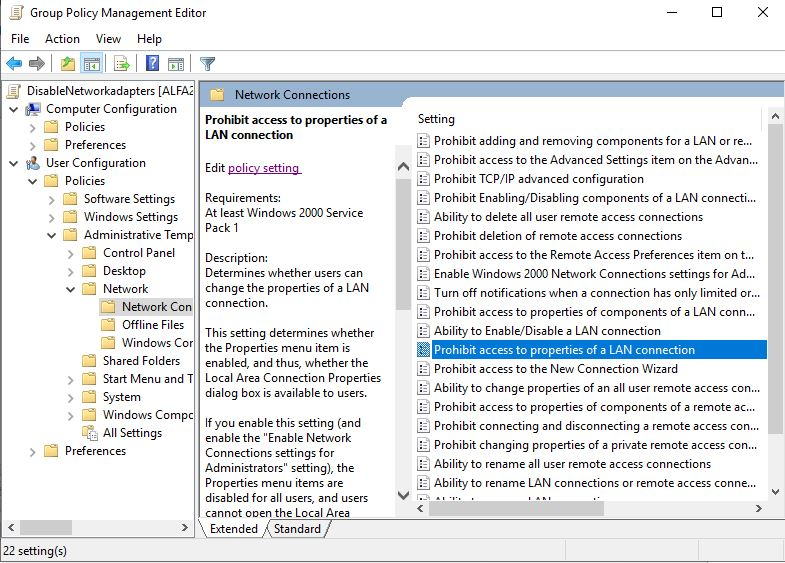

# Verslag Alfa2

Auteur(s) verslag: Kimberly De Clercq

## Installatie en configuratie
1. Download een [ISO file](https://www.microsoft.com/en-us/evalcenter/evaluate-windows-server-2019?filetype=ISO)  van Windows Server 2019.
2. Maak een VM genaamd `Alfa2`. 
3. Open de VM en installeer de `Guest Additions`
4. Sluit de VM.
5. Maak een `shared folder` in het menu van VirtualBox. Dit doe je door op `Gedeelde mappen` en vervolgens op `Toevoegen gedeelde map` te klikken. Hier selecteer je de map waar de scripts voor alfa2 staan. Dit is bijvoorbeeld: `C:\Users\Eigenaar\Desktop\HoGent\3TIN\Projecten III\p3ops-1920-red\Servers\Alfa2\Testomgeving\Scripts`. Je kiest een naam voor het pad. Je zorgt ervoor dat `Automatisch koppelen` aangevinkt staat. Mount point mag je leeg laten. 
6. Start je VM opnieuw op en controleer of je bij `This PC` uw shared folder ziet staan op de `Z-schijf`. 
7. Open de `Z-schijf`. 
8. Rechtermuisknop op het eerste script `1_RUNFIRST.ps1`. Kies `Run with Powershell`. Voer het script uit. Het password is `Admin2019`
9. Door dit script uit te voeren zullen de volgende 3 script `2_installDCDNS, 3_ConfigDCDNS en 4_ADstructure` ook automatisch uitgevoerd worden. 
10. Volg het stappenplan onder `Stappenplan beleidsregels` om de beleidsregels handmatig op de domeincontroller in de GUI in te stellen. 
11. Script `5_AGDLP_PERMISSIONS` kan pas uitgevoerd worden nadat server `Lima2` klaar is. 
12. Script `999_PrepareADforSCCM` kan pas uitgevoerd worden nadat de servers `Bravo2` en `Papa2` klaar zijn. 

## Informatie DC en DNS
De server username is `Administrator` met als password `Admin2019`.   
De domeinname van de server `ns1` is `red.local`.   

** MOET NOG AANGEVULD WORDEN ** 

## Informatie AD structuur
De gebruikers worden aangemaakt en in de juiste afdeling gesorteerd. Elke gebruiker kan zich inloggen met het wachtwoord `Administrator2019`.   

De volgende tabel toont de instellingen van de gebruikers. 

| Employee-ID | Voornaam | Familienaam | Gebruikersnaam | Afdeling | Manager | Office | Telefoonnr. | Path | Woonplaats | 
| -------- | --------- | ---------- | ----------- | ------------- | ----- | ------ | ------ | ------ | -------- | ------- |
| 1003 | Arno | Van Nieuwenhove | ArnoVN | Directie | Kimberly | B0.002 | 0444727273 | OU=Directie,DC=red,DC=local | Ninove |
| 1004 | Kimberly | De Clercq | KimberlyDC | Directie | - | B0.001 | 0444727272 | OU=Directie,DC=red,DC=local | Ingelmunster |
| 1558 | CedricD | Detemmerman | CedricD | Ontwikkeling | Jannes | B1.018 |  0444727293 | OU=Ontwikkeling,DC=red,DC=local | Haaltert |
| 1578 | Jonas | Vandegehuchte | JonasV | Ontwikkeling | Jannes | B1.018 |  0444727291 | OU=Ontwikkeling,DC=red,DC=local | Bierbeek |
| 1658 | Robin | Van de Walle | RobinVDW | Ontwikkeling | Jannes | B1.018  | 0444727295 | OU=Ontwikkeling,DC=red,DC=local | Haaltert |
| 2014 | Levi | Goessens | LeviG | IT_Administratie | Laurens | B4.037  | 0444727284 | OU=IT_Administratie,DC=red,DC=local | Denderwindeke |
| 2015 | Laurens | Blancquaert-Cassaer | LaurensBC | IT_Administratie | Kimberly | B4.037  | 0444727280 | OU=IT_Administratie,DC=red,DC=local | Gent |
| 2210 | Yngvar | Samyn | YngvarS | Administratie | Joachim | B4.002  | 0444727262 | OU=Administratie,DC=red,DC=local | Ingooigem |
| 2531 | Joachim | Van de Keere | JoachimVDK | Administratie | Kimberly | B4.002 |  0444727260 | OU=Administratie,DC=red,DC=local | Sint-Martens-Latem |
| 2532 | Tim | Grijp | TimG | Administratie | Joachim | B4.002 | 0444727263 | OU=Administratie,DC=red,DC=local | Sint-Martens-Latem |
| 2731 | Rik | Claeyssens | RikC | Administratie | Joachim | B4.002 | 0444727264 | OU=Administratie,DC=red,DC=local | Sint-Martens-Latem |
| 4732 | Matthias | Van de Velde | MatthiasVDV | Verkoop | Kimberly | B0.015 | 0444727200 | OU=Verkoop,DC=red,DC=local | Koksijde |
| 4736 | Robby | Daelman | RobbyD | Verkoop | Matthias | B0.015  | 0444727204 | OU=Verkoop,DC=red,DC=local | Lede |
| 5078 | Jannes | Van Wonterghem | JannesVW | Ontwikkeling | Kimberly | B1.018  | 0444727290 | OU=Ontwikkeling,DC=red,DC=local | Zoersel |
| 5079 | Cédric | Van den Eede | CedricVDE | Ontwikkeling | Jannes | B1.018 | 0444727292 | OU=Ontwikkeling,DC=red,DC=local | Meldert |
| 5423 | Elias | Waterschoot | EliasW | Verkoop | Matthias | B0.015 | 0444727202 | OU=Verkoop,DC=red,DC=local | Torhout |
| 5822 | Nathan | Cammerman | NathanC | Verkoop | Matthias | B0.015 | 0444727201 | OU=Verkoop,DC=red,DC=local | Torhout |
| 6312 | Tibo | Vanhercke | TiboV | Administratie | Joachim | B4.002 | 0444727261 | OU=Administratie,DC=red,DC=local | Ingooigem |
| 7215 | Alister | Adutwum | AlisterA | Verkoop | Matthias | B0.015  | 0444727206 | OU=Verkoop,DC=red,DC=local | Torhout |
| 8424 | Aron | Marckx | AronM | IT_Administratie | Laurens | B4.037  | 0444727285 | OU=IT_Administratie,DC=red,DC=local | Meldert |
| 8425 | Ferre | Verstichelen | FerreV | IT_Administratie | Laurens | B4.037  |  0444727281 | OU=IT_Administratie,DC=red,DC=local | Wervik |
| 8486 | Sean | Vancompernolle | SeanV | Verkoop | Matthias | B1.015 |  0444727207 | OU=Verkoop,DC=red,DC=local | Ieper |
| 8653 | Jens | Van Liefferinge | JensVL | IT_Administratie | Laurens| B4.037 | 0444727282 | OU=IT_Administratie,DC=red,DC=local | Lokeren |

## Stappenplan beleidsregels
Hieronder volgt een stappenplan hoe je de GPO's in de GUI instelt.   
Er moeten drie GPO's worden ingesteld:    
1. Verbied iedereen uit alle afdelingen behalve IT Administratie de toegang tot het control panel
2. Verwijder het games link menu uit het start menu voor alle afdelingen
3. Verbied iedereen uit de afdelingen Administratie en Verkoop de toegang tot de eigenschappen van de netwerkadapters

Eerst worden de GPO's (DisableControlPanel, RemoveGameLink en DisableNetworkadapters) gemaakt.   
Ga in de Server Manager naar Tools en kies voor `Group Policy Management`. Kies voor Forest: red.local > Domains  
Rechtsklik op `red.local` en kies voor `Create a GPO in this domain, and Link it here...`.   

Vervolgens gaan we de GPO linken aan de juiste afdelingen. 
Onder red.local kies je een afdeling. In de afbeelding linken we de GPO's voor de afdeling `Verkoop`. 
Rechtsklik op `Verkoop` en kies voor `Link an Existing GPO...`    
  

Voor verkoop link je de GPO's `DisableControlPanel`, `RemoveGameLink` en `DisableNetworkadapters`.   
Je selecteert één GPO en klikt op `OK`. Daarna rechtsklik je opnieuw op `Verkoop`en kies je `Link an Existing GPO...`. Nu selecteer je een andere GPO en klik je opnieuw op `OK`. 
Deze stap herhaal je tot alle GPO's aan de juiste afdelingen gelinkt zijn.   
Hieronder zie je welke GPO's elke afdeling moet hebben.  
1. **Verkoop**: DisableControlPanel, RemoveGameLink, DisableNetworkadapters
2. **IT_Administratie**: RemoveGameLink
3. **Administratie**: DisableControlPanel, RemoveGameLink, DisableNetworkadapters
4. **Directie**: DisableControlPanel, RemoveGameLink
5. **Ontwikkeling**: DisableControlPanel, RemoveGameLink

Tot slot gaan we de group policies configureren.
Hiervoor gaan we in het venster `Group Policy Management` naar `Group Policy Objects`.   
Rechtsklik op de group policy `DisableControlPanel` en kies voor `Edit...`.   
   

Nu verkrijgen we een nieuw venster genaamd `Group Policy Management Editor`. Hier kiezen we voor `User Configuration` > Policies > Administrative Templates: Policy definitions (ADMX files) retrieved from the local computer. > Control Panel > Display  
Dubbelklik op `Disable the Display Control Panel`. Kies voor `Enabled` en `Apply` de nieuwe instellingen. Klik op `OK`.   
   
Nu hebben we de eerste GPO ingesteld, zodat de toegang tot het control panel verboden is voor de afdelingen die deze GPO gelinkt zijn. 

Nu gaan we het games link menu uit het start menu verwijderen.   
Ga terug naar het scherm `Group Policy Management` en klik op de `RemoveGameLink` group policy onder `Group Policy Objects`.   
Rechtsklik op `RemoveGameLink` en kies `Edit...`   
   

Opnieuw kiezen we in het pop-up venster `Group Policy Manager Editor` voor `User Configuration` > Policies >  Administrative Templates: Policy definitions (ADMX files) retrieved from the local computer.  
Nu kiezen we voor `Start Menu and Taskbar`. Zoek in deze lijst `Remove Games link from Start Menu` en dubbelklik erop. Kies opnieuw voor `Enabled` > `Apply` en vervolgens `OK`.   
Nu hebben we de GPO ingesteld zodat de game link uit het start menu verwijderd zal worden voor alle afdelingen, want deze group policy hebben we aan alle afdelingen gelinkt.   
   

Voor de laatste GPO `DisableNetworkadapters` te configureren, gaan we opnieuw naar het scherm `Group Policy Management` en onder `Group Policy Objects` klikken we rechts op `DisableNetworkadapters` en kiezen we voor `Edit...`.   
In het pop-up venster `Group Policy Manager Editor` kiezen we opnieuw voor `User Configuration` > Policies >  Administrative Templates: Policy definitions (ADMX files) retrieved from the local computer.  
Nu selecteren we `Network` en vervolgens `Network Connections`. 
In deze lijst zoeken we `Prohibit access to properties of a LAN connection` om de toegang tot de eigenschappen van de netwerkadapters te verbieden. Kies voor `Edit policy setting` en `Enabled` deze group policy setting. Let op bij het instellen van deze group policy. Kies hier voor **Disabled** en `Apply` deze setting. Klik vervolgens op `OK`. 
   

Nu zijn alle group policies op de domeincontroller ingesteld.   

## Informatie AGDLP

## Informatie SCCM

## Bronnen
[Managing OUs](https://blog.netwrix.com/2018/06/26/managing-ous-and-moving-their-objects-with-powershell/)    
[New-ADComputer](https://docs.microsoft.com/en-us/powershell/module/addsadministration/new-adcomputer?view=win10-ps)    
[Roaming profiles](https://sid-500.com/2017/08/27/active-directory-configuring-roaming-profiles-using-gui-and-powershell/)   
[Disable Control Panel](https://www.isunshare.com/windows-8/disable-display-control-panel.html)  
[Link GPO to OU](https://www.manageengine.com/products/active-directory-audit/kb/how-to/how-to-link-a-gpo-to-an-ou.html)  
[Dell - GPO in GUI](https://www.dell.com/support/article/be/fr/bedhs1/sln283093/windows-server-cr%C3%A9ation-et-liaison-d-un-objet-de-strat%C3%A9gie-de-groupe-%C3%A0-l-aide-de-la-console-de-gestion-des-strat%C3%A9gies-de-groupe?lang=fr)  

