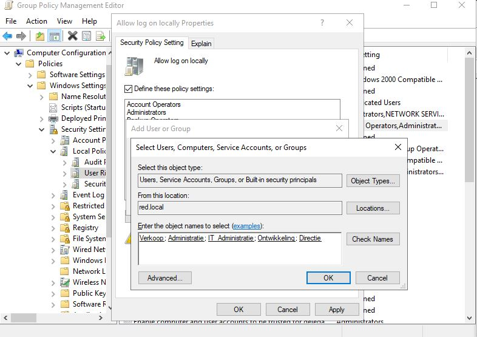
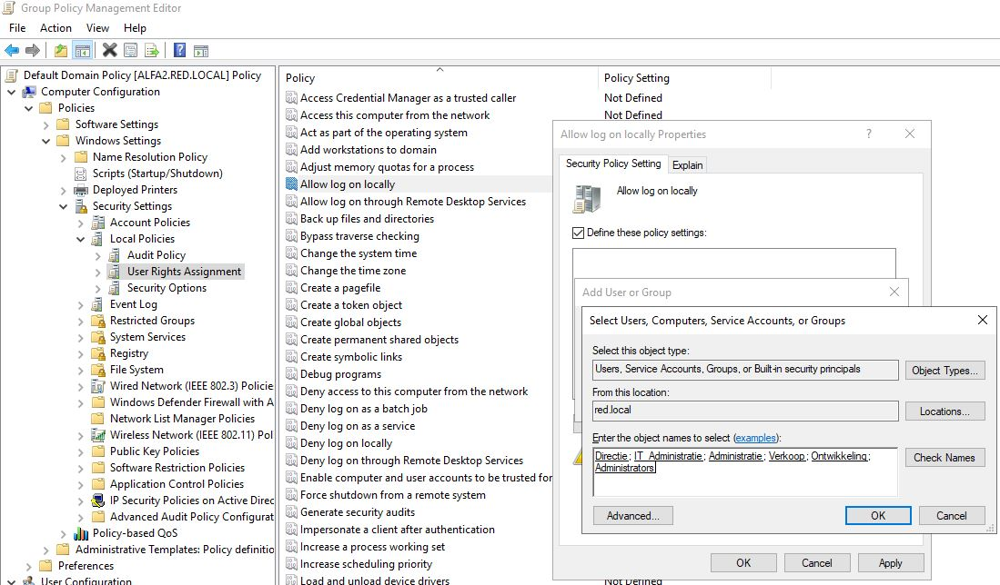

# Verslag Alfa2

Auteur(s) verslag: Kimberly De Clercq & Laurens Blancquaert-Cassaer

## Installatie en configuratie
De scripts van Alfa2 zijn zo gemaakt dat je enkel het eerste script (1_RUNFIRST.ps1) moet uitvoeren en dat elk script daarna het volgende script oproept zelfs wanneer de server herstart in het script. Wat de scripts precies doen staat in commentaar stap voor stap uitgelegd bij alle commando’s. Er wordt ook gebruik gemaakt van files die geïnstalleerd worden via de scripts. Deze files staan in: `Alfa2/Testomgeving/Scripts/ExtendADschema/`

1. Download een [ISO file](https://www.microsoft.com/en-us/evalcenter/evaluate-windows-server-2019?filetype=ISO)  van Windows Server 2019.
2. Maak een VM genaamd `Alfa2`.
3. Open de VM en installeer de `Guest Additions`
4. Sluit de VM.
5. Maak een `shared folder` in het menu van VirtualBox. Dit doe je door op `Gedeelde mappen` en vervolgens op `Toevoegen gedeelde map` te klikken. Hier selecteer je de map waar de scripts voor alfa2 staan. Dit is bijvoorbeeld: `C:\Users\Eigenaar\Desktop\HoGent\3TIN\Projecten III\p3ops-1920-red\Servers\Alfa2\Testomgeving\Scripts`. Je kiest een naam voor het pad. Je zorgt ervoor dat `Automatisch koppelen` aangevinkt staat. Mount point mag je leeg laten.
6. Start je VM opnieuw op en controleer of je bij `This PC` uw shared folder ziet staan op de `Z-schijf`.
7. Open de `Z-schijf`.
8. Rechtermuisknop op het eerste script `1_RUNFIRST.ps1`. Kies `Run with Powershell`. Voer het script uit. Het password is `Admin2019`
9. Door dit script uit te voeren zullen de volgende 3 script `2_installDCDNS, 3_ConfigDCDNS en 4_ADstructure` ook automatisch uitgevoerd worden.
10. Volg het stappenplan onder `Stappenplan beleidsregels` om de beleidsregels handmatig op de domeincontroller in de GUI in te stellen.
11. Script `999_PrepareADforSCCM` kan uitgevoerd worden na `4_ADstructure`, dit moet uitgevoerd worden **voor** `Papa2` begonnen is.

## Informatie DC en DNS
### Basics:
De server username is `RED\Administrator` met als password `Admin2019`. De domeinnaam van de server `Alfa2` is `red.local`.

Alfa2 maakt gebruik van volgend commando om wanneer er (door een actie in het script) een reboot nodig is het volgende script automatisch wordt ingeladen:
```ps1
Set-ItemProperty -Path 'HKLM:\Software\Microsoft\Windows\CurrentVersion\RunOnce' -Name ResumeScript -Value "C:\Windows\system32\WindowsPowerShell\v1.0\Powershell.exe" -ExecutionPolicy Bypass -File "$VBOXdrive\2_installDCDNS.ps1"
```
Dit commando laadt een "RunOnce" object in de registry met als value het volgende script. Een RunOnce object wordt bij het **eerstvolgende** opstarten van de server automatisch uitgevoerd.

Om dit automatisch te laten werken gebruiken we volgende twee commando's om automatisch in te loggen als administrator (Na installatie van het domein de domain administrator):  
```ps1
Set-ItemProperty -Path "HKLM:\SOFTWARE\Microsoft\Windows NT\CurrentVersion\Winlogon" -Name DefaultUserName -Value $Username  
Set-ItemProperty -Path "HKLM:\SOFTWARE\Microsoft\Windows NT\CurrentVersion\Winlogon" -Name DefaultPassword -Value $Password 
Set-ItemProperty -Path "HKLM:\SOFTWARE\Microsoft\Windows NT\CurrentVersion\Winlogon" -Name ForceAutoLogon -Value 1  
Set-ItemProperty -Path "HKLM:\SOFTWARE\Microsoft\Windows NT\CurrentVersion\Winlogon" -Name AutoAdminLogon -Value 1
``` 
In de variables $Username en $Password kan je dan de gewenste inlog credentials ingeven.

Alle scripts maken gebruik van logfiles die opgeslaan worden in: `C:\Scriptlogs`
We doen dit door gebruik te maken van het `Start-Transcript` en `Stop-Transcript` commando.

### Active Directory installatie:
In het **2_InstallDCDNS.ps1** script wordt eerst de juiste tijd en tijdzone ingesteld alsook de correcte IP-instellingen voor Alfa2:  
```console
IP-adres: 172.18.1.66  
Subnet mask: /27
Default Gateway: 172.18.1.65
```

Om Alfa2 in te stellen als Domain Controller moeten we eerst volgende Windows Features installeren die nodig zijn voor de active directory:  
```ps1
Install-WindowsFeature AD-Domain-Services

Install-WindowsFeature RSAT-AD-AdminCenter 
Install-WindowsFeature RSAT-ADDS-Tools
```
De installatie van de ADDS zelf doen we met het volgende commando:  
```ps1
install-ADDSForest -DomainName $domain
                  -ForestMode 7
                  -DomainMode 7
                  -installDns:$true
                  -createDNSDelegation:$false
                  -SafeModeAdministratorPassword $DSRM
                  -force:$true
```
Aangezien deze cmdlet heel belangrijk is is hier een correcte uitleg van de gebruikte options:  
- ForestMode 7 = Specifieert het forest functional level. 7 = Windows Server 2016 en 2019. Dit moet je instellen op de laagste Windows Server versie in je domein  
- DomainMode 7 = Specifieert het domain functional level. 7 = Windows Server 2016 en 2019. Dit moet je instellen op de laagste Windows Server versie in je domein  
- InstallDNS:$true = DNS wordt geïnstalleerd bij de installatie van Active Directory  
- CreateDNSDelegation:$false = Dit is niet van toepassing omdat Alfa2 de eerste DNS server is dus er kan geen DNS delegatie gebeuren (bij Bravo2 de tweede domeincontroller staat deze option op $true)     
- SafeModeAdministratorPassword \$DSRM = Geef het password in dat gebruikt wordt wanneer de computer in safe mode wordt opgestart (dit wachtwoord is verplicht voor de installatie van ADDNS)  
- force:$true = Run het cmdlet zonder enige user interactie

### DNS configuratie:
In het **3_ConfigDCDNS.ps1** script wordt de DNS zone en DNS records geconfigureerd.

Eerst wordt de **red.local** primary zone die tijdens de ADDNS role installatie automatisch werd aangemaakt geconfigureerd om DNS delegation toe te laten naar Bravo2:   
`Set-DnsServerPrimaryZone -Name "red.local" -SecureSecondaries "TransferToZoneNameServer"`

Hierna worden de DNS records aangemaakt voor alle servers in het **red.local** domein. De ip adressen worden opgeslaan in volgende variables:

```bash
[string]$Bravo2IP    = "172.18.1.67" # DC2 / DNS2    
[string]$Charlie2IP  = "172.18.1.68" # Exchange Server   
[string]$Delta2IP    = "172.18.1.69" # IIS Webserver   
[string]$Kilo2IP     = "172.18.1.1" # DHCP Server   
[string]$Lima2IP     = "172.18.1.2" # File Server
[string]$Mike2IP     = "172.18.1.3" # Intranet Sharepoint Server
[string]$November2IP = "172.18.1.4" # SQL Server
[string]$Oscar2IP    = "172.18.1.5" # Monitoring Server
[string]$Papa2IP     = "172.18.1.6" # SCCM Server
[string]$local_ip    = "172.18.1.66" # Alfa2 ip
```

Om de DNS records aan te maken worden volgende commando's gebruikt:  
`Add-DnsServerResourceRecordMX`, `Add-DnsServerResourceRecordCName` en `Add-DnsServerResourceRecordA`.   
We werken met een function die kijkt of de DNS record van het A type (bijna alle servers), MX type (Exchange server) of Cname type is, en dan het juiste commando selecteert voor de betreffende DNS record.

De volgende stap is DNS forwarding instellen op de Hogent DNS servers (voor DNS requests dat onze Alfa2 DNS server niet herkent):  
```ps1
Add-DnsServerForwarder -IPAddress 193.190.173.1,193.190.173.2
```
Daarna stellen we de DNS instellingen van de ipv4 LAN NIC in met:  
```ps1
Set-DnsClientServerAddress -InterfaceAlias "LAN" -ServerAddresses($local_ip, $secondary_dc_ip)
```

De laatste stap in het configureren van DNS is een primary zone aanmaken voor het Linux **green.local** domein en de mail server toe te voegen in dit domein:  
```ps1
Add-DnsServerPrimaryZone -Name "green.local" -ReplicationScope "Forest" 
Set-DnsServerPrimaryZone -Name "green.local" -SecureSecondaries "TransferToZoneNameServer" 
Add-DnsServerResourceRecordA -Name "mail" -ZoneName "green.local" -IPv4Address "172.16.1.68"
Add-DnsServerResourceRecordMX -Name "mail" -MailExchange "mail.green.local" -Preference 100 -ZoneName "green.local"
Add-DnsServerResourceRecordCName -Name "owa" -HostNameAlias "mail.green.local" -ZoneName "green.local"

```

Als laatste stap wordt het **4_ADStructure.ps1** script ingeladen:  
`Start-Process powershell -Verb runAs -ArgumentList "$VBOXdrive\4_ADstructure.ps1"`  
Dit commando opent PowerShell.exe als administrator en voert ons volgende script uit.

## Informatie AD structuur
De gebruikers worden aangemaakt en in de juiste afdeling gesorteerd. Elke gebruiker kan zich inloggen met het wachtwoord `Administrator2019`.   

De volgende tabel toont de instellingen van de gebruikers.

| ID | Firstname | Surname | Username | Afdeling | Manager | Office | Tel. Nr. | Woonplaats |
| -------- | --------- | ---------- | ----------- | ------------- | ----- | ------ | ------ |  -------- |
| 1003 | Arno | Van Nieuwenhove | ArnoVN | Directie | Kimberly | B0.002 | 0444727273 | Ninove |
| 1004 | Kimberly | De Clercq | KimberlyDC | Directie | - | B0.001 | 0444727272 | Ingelmunster |
| 1558 | CedricD | Detemmerman | CedricD | Ontwikkeling | Jannes | B1.018 |  0444727293 | Haaltert |
| 1578 | Jonas | Vandegehuchte | JonasV | Ontwikkeling | Jannes | B1.018 |  0444727291 | Bierbeek |
| 1658 | Robin | Van de Walle | RobinVDW | Ontwikkeling | Jannes | B1.018  | 0444727295 | Haaltert |
| 2014 | Levi | Goessens | LeviG | IT_Administratie | Laurens | B4.037  | 0444727284 | Denderwindeke |
| 2015 | Laurens | Blancquaert-Cassaer | LaurensBC | IT_Administratie | Kimberly | B4.037  | 0444727280 | Gent |
| 2210 | Yngvar | Samyn | YngvarS | Administratie | Joachim | B4.002  | 0444727262 | Ingooigem |
| 2531 | Joachim | Van de Keere | JoachimVDK | Administratie | Kimberly | B4.002 |  0444727260 | Sint-Martens-Latem |
| 2532 | Tim | Grijp | TimG | Administratie | Joachim | B4.002 | 0444727263 |  Sint-Martens-Latem |
| 2731 | Rik | Claeyssens | RikC | Administratie | Joachim | B4.002 | 0444727264 | Sint-Martens-Latem |
| 4732 | Matthias | Van de Velde | MatthiasVDV | Verkoop | Kimberly | B0.015 | 0444727200 |  Koksijde |
| 4736 | Robby | Daelman | RobbyD | Verkoop | Matthias | B0.015  | 0444727204 | Lede |
| 5078 | Jannes | Van Wonterghem | JannesVW | Ontwikkeling | Kimberly | B1.018  | 0444727290 | Zoersel |
| 5079 | CedricVDE | Van den Eede | CedricVDE | Ontwikkeling | Jannes | B1.018 | 0444727292  | Meldert |
| 5423 | Elias | Waterschoot | EliasW | Verkoop | Matthias | B0.015 | 0444727202 |  Torhout |
| 5822 | Nathan | Cammerman | NathanC | Verkoop | Matthias | B0.015 | 0444727201 | Torhout |
| 6312 | Tibo | Vanhercke | TiboV | Administratie | Joachim | B4.002 | 0444727261 | Ingooigem |
| 7215 | Alister | Adutwum | AlisterA | Verkoop | Matthias | B0.015  | 0444727206 | Torhout |
| 8424 | Aron | Marckx | AronM | IT_Administratie | Laurens | B4.037  | 0444727285 | Meldert |
| 8425 | Ferre | Verstichelen | FerreV | IT_Administratie | Laurens | B4.037  |  0444727281 |  Wervik |
| 8486 | Sean | Vancompernolle | SeanV | Verkoop | Matthias | B1.015 |  0444727207 | Ieper |
| 8653 | Jens | Van Liefferinge | JensVL | IT_Administratie | Laurens| B4.037 | 0444727282 | Lokeren |

De volgende tabel toont de instellingen van de computers.  

| ADComputer | SamAccountName Workstation | SamAccountName User | Location |
| -------- | --------- | ---------- | ---------- |
| Directie_001 | Directie001 | KimberlyDC | Gent |
| Directie_002 | Directie002 | ArnoVN | Aalst |
| Administratie_001 | Admin001 | JoachimVDK | Gent |
| Administratie_002 | Admin002 | TiboV | Gent |
| Administratie_003 | Admin003 | YngvarS | Gent |
| Administratie_004 | Admin004 | TimG | Gent |
| Administratie_005 | Admin005 | RikC | Gent |
| Verkoop_001 | Verkoop001 | MatthiasVDV | Gent |
| Verkoop_002 | Verkoop002 | RobbyD | Aalst |
| Verkoop_003 | Verkoop003 | NathanC | Gent |
| Verkoop_004 | Verkoop004 | EliasW | Gent |
| Verkoop_005 | Verkoop005 | AlisterA | Gent |
| Verkoop_006 | Verkoop006 | SeanV | Gent |
| Ontwikkeling_001 | Ontwikkeling001 | JannesVW | Gent |
| Ontwikkeling_002 | Ontwikkeling002 | JonasV | Gent |
| Ontwikkeling_003 | Ontwikkeling003 | CedricVDE | Aalst |
| Ontwikkeling_004 | Ontwikkeling004 | CedricD | Aalst |
| Ontwikkeling_005 | Ontwikkeling005 | RobinVDW | Gent |
| ITAdministratie_001 | ITAdmin001 | LaurensBC | Gent |
| ITAdministratie_002 | ITAdmin002 | FerreV | Gent |
| ITAdministratie_003 | ITAdmin003 | LeviG | Aalst |
| ITAdministratie_004 | ITAdmin004 | AronM | Aalst |
| ITAdministratie_005 | ITAdmin005 | JensVL | Gent |

## Stappenplan beleidsregels
Hieronder volgt een stappenplan hoe je de GPO's in de GUI instelt.   
Er moeten drie GPO's worden ingesteld:    
1. Verbied iedereen uit alle afdelingen behalve IT Administratie de toegang tot het control panel
2. Verwijder het games link menu uit het start menu voor alle afdelingen
3. Verbied iedereen uit de afdelingen Administratie en Verkoop de toegang tot de eigenschappen van de netwerkadapters


Eerst moeten we nog de default GPO's aanpassen zodat de gebruikers zich kunnen inloggen. Ga naar Tools in Server Manager, vervolgens klik je op `Group Policy Management`. Ga naar `Forest: red.local` > Domains > red.local > Group Policy Objects. Rechtermuisklik op  **Default Domain Controllers Policy** en klik op `Edit...`. Zie onderstaande afbeelding.
  
Klik vervolgens door op Computer Configuration > Policies > Windows Settings > Security Settings > Local Policies > User Rights Assignment. Dubbelklik op `Allow log on locally`. Klik op `Add User or Group...`, klik vervolgens op `Browse ...`. Vul de groepen (Verkoop; Administratie; IT_Administratie; Ontwikkeling; Directie) in bij 'Enter the object names to select (examples):'. Scheidt de groepen door middel van een puntkomma ";". Klik op `Check Names`. Zorg ervoor dat ook de Administrators toegevoegd zijn. Klik vervolgens op 'OK' en 'Apply'.   
  

Voor de default GPO **Default Domain Policy** doen we exact hetzelfde. We gaan in het venster van `Group Policy Management` naar Default Domain Policy. Hier klikken we rechts op `Edit...`. Klik opnieuw door op Computer Configuration > Policies > Windows Settings > Security Settings > Local Policies > User Rights Assignment. Dubbelklik op `Allow log on locally`. Vink `Define these policy settings:` aan en klik op `Add User or Group...`. Klik vervolgens opnieuw op `Browse ...` en vul de groepen in. Vergeet de administrators niet toe te voegen. Klik op `Check Names` om te controleren of dit geldige groepen zijn.   
Zie onderstaande afbeelding. Klik vervolgens op 'OK' en 'Apply'.   
  

Nu kunnen alle gebruikers in deze groepen zich inloggen.  

Vervolgens maken we zelf een aantal GPO's (**DisableControlPanel**, **RemoveGameLink** en **DisableNetworkadapters**).   
Ga in de Server Manager naar Tools en kies voor `Group Policy Management`. Kies voor Forest: red.local > Domains  
Rechtsklik op `red.local` en kies voor `Create a GPO in this domain, and Link it here...`.   
    
Daarna gaan we de GPO linken aan de juiste afdelingen.
Onder red.local kies je een afdeling. In de afbeelding linken we de GPO's voor de afdeling `Verkoop`.  
Rechtsklik op `Verkoop` en kies voor `Link an Existing GPO...`    
   

Voor verkoop link je de GPO's `DisableControlPanel`, `RemoveGameLink` en `DisableNetworkadapters`.   
Je selecteert één GPO en klikt op `OK`. Daarna rechtsklik je opnieuw op `Verkoop` en kies je `Link an Existing GPO...`. Nu selecteer je een andere GPO en klik je opnieuw op `OK`.
Deze stap herhaal je tot alle GPO's aan de juiste afdelingen gelinkt zijn.   
Hieronder zie je welke GPO's elke afdeling moet hebben.  
1. **Verkoop**: DisableControlPanel, RemoveGameLink, DisableNetworkadapters
2. **IT_Administratie**: RemoveGameLink
3. **Administratie**: DisableControlPanel, RemoveGameLink, DisableNetworkadapters
4. **Directie**: DisableControlPanel, RemoveGameLink
5. **Ontwikkeling**: DisableControlPanel, RemoveGameLink

Tot slot gaan we de group policies configureren.
Hiervoor gaan we in het venster `Group Policy Management` naar `Group Policy Objects`.   
Rechtsklik op de group policy `DisableControlPanel` en kies voor `Edit...`.   
   

Nu verkrijgen we een nieuw venster genaamd `Group Policy Management Editor`. Hier kiezen we voor `User Configuration` > Policies > Administrative Templates: Policy definitions (ADMX files) retrieved from the local computer. > Control Panel > Display  
Dubbelklik op `Disable the Display Control Panel`. Kies voor `Enabled` en `Apply` de nieuwe instellingen. Klik op `OK`.   
     
Nu hebben we de eerste GPO ingesteld, zodat de toegang tot het control panel verboden is voor de afdelingen die deze GPO gelinkt zijn.

Nu gaan we het games link menu uit het start menu verwijderen.   
Ga terug naar het scherm `Group Policy Management` en klik op de `RemoveGameLink` group policy onder `Group Policy Objects`.   
Rechtsklik op `RemoveGameLink` en kies `Edit...`   
   

Opnieuw kiezen we in het pop-up venster `Group Policy Manager Editor` voor `User Configuration` > Policies >  Administrative Templates: Policy definitions (ADMX files) retrieved from the local computer.  
Nu kiezen we voor `Start Menu and Taskbar`. Zoek in deze lijst `Remove Games link from Start Menu` en dubbelklik erop. Kies opnieuw voor `Enabled` > `Apply` en vervolgens `OK`.   
Nu hebben we de GPO ingesteld zodat de game link uit het start menu verwijderd zal worden voor alle afdelingen, want deze group policy hebben we aan alle afdelingen gelinkt.   
   
Voor de laatste GPO `DisableNetworkadapters` te configureren, gaan we opnieuw naar het scherm `Group Policy Management` en onder `Group Policy Objects` klikken we rechts op `DisableNetworkadapters` en kiezen we voor `Edit...`.   
In het pop-up venster `Group Policy Manager Editor` kiezen we opnieuw voor `User Configuration` > Policies >  Administrative Templates: Policy definitions (ADMX files) retrieved from the local computer.  
Nu selecteren we `Network` en vervolgens `Network Connections`.
In deze lijst zoeken we `Prohibit access to properties of a LAN connection` om de toegang tot de eigenschappen van de netwerkadapters te verbieden. Kies voor `Edit policy setting`. Let op bij het instellen van deze group policy. Kies hier voor **Disabled** en `Apply` deze setting. Klik vervolgens op `OK`.
   
Nu zijn alle group policies op de domeincontroller ingesteld.   

## Informatie SCCM
Om SCCM te kunnen installeren (op de Papa2 server) zijn er enkele prerequisites dat we in de domain controller moeten uitvoeren.

We moeten aanpassingen maken in de Active directory structuur door nieuwe attributes toe te voegen waar SCCM gebruik van maakt. Het toevoegen van deze attributes gebeurt met een .exe file die je in de installatie ISO van SCCM vind. (**extadsch.exe**)  
Deze file vind je bij ons terug in `Alfa2/Testomgeving/Scripts/ExtendADschema`

Voor we dit doen moeten we eerst een nieuw computerobject maken in de active directory voor Papa2:  
`New-ADComputer -Name "Papa2"`

De eerste belangrijke stap is om een "System Management" container aan te maken onder de "System" OU in active directory. Deze commando's maken deze container aan:
```ps1
$ASDIconnection = [ADSI]"LDAP://localhost:389/cn=System,dc=red,dc=local"
$SysManContainer = $ASDIconnection.Create("container", "cn=System Management")
$SysManContainer.SetInfo()
```
Daarna moet je alle permissies van deze container delegeren aan het Papa2 computerobject. Belangrijk hierbij is dat je als permissies "full control" instelt alsook de option "Applies to this object and all descendant objects" gebruikt.  
```ps1
$SystemManagementCN = [ADSI]("LDAP://localhost:389/CN=System Management,CN=System,DC=red,DC=local")
$SCCMserver = Get-ADComputer "Papa2"
$SID = [System.Security.Principal.SecurityIdentifier] $SCCMserver.SID
$ServerIdentity = [System.Security.Principal.IdentityReference] $SID

$permissions = [System.DirectoryServices.ActiveDirectoryRights] "GenericAll"
$allow = [System.Security.AccessControl.AccessControlType] "Allow"
$inheritanceAll = [System.DirectoryServices.ActiveDirectorySecurityInheritance] "All"

$PermissionsRule = New-Object System.DirectoryServices.ActiveDirectoryAccessRule
$ServerIdentity,$permissions,$allow,$inheritanceAll

$SystemManagementCN.psbase.ObjectSecurity.AddAccessRule($PermissionsRule)
$SystemManagementCN.psbase.commitchanges()
```
Al deze commando's samen zullen de "Full control" permissions van de "System Management" OU delegeren aan het Papa2 computerobject

De laatste stap om Alfa2 te configureren is om het **extadsch.exe** bestand uit te voeren. Dit bestand zal dan de juiste attributes installeren in de active directory die SCCM nodig heeft (deze attributes worden geïnstalleerd in de System Management container OU). Kopieer eerst de .exe file naar je bureaublad onder de `C:\Users\Administrator\Desktop\ExtendADschema\` directory.  
Voer daarna volgend commando uit om de .exe file uit te voeren:   
`Start-Process "C:\Users\Administrator\Desktop\ExtendADschema\extadsch.exe"`

Belangrijk is om daarna de log file die worden aangemaakt te checken. Je vindt deze in `C:\extadsch.log`.  
Kijk hier of het extenden van het AD schema met de nieuwe attributes gelukt is.

## Sources
**Managing OU's**: [https://blog.netwrix.com/2018/06/26/managing-ous-and-moving-their-objects-with-powershell/](https://blog.netwrix.com/2018/06/26/managing-ous-and-moving-their-objects-with-powershell/)      
**New-ADComputer:** [https://docs.microsoft.com/en-us/powershell/module/addsadministration/new-adcomputer?view=win10-ps](https://docs.microsoft.com/en-us/powershell/module/addsadministration/new-adcomputer?view=win10-ps)    
**Roaming profiles**: [https://sid-500.com/2017/08/27/active-directory-configuring-roaming-profiles-using-gui-and-powershell/](https://sid-500.com/2017/08/27/active-directory-configuring-roaming-profiles-using-gui-and-powershell/)   
**Disable Control Panel**: [https://www.isunshare.com/windows-8/disable-display-control-panel.html](https://www.isunshare.com/windows-8/disable-display-control-panel.html)  
**Link GPO to OU**: [https://www.manageengine.com/products/active-directory-audit/kb/how-to/how-to-link-a-gpo-to-an-ou.html](https://www.manageengine.com/products/active-directory-audit/kb/how-to/how-to-link-a-gpo-to-an-ou.html)  
**Dell - GPO in GUI**: [https://www.dell.com/support/article/be/fr/bedhs1/sln283093/windows-server-cr%C3%A9ation-et-liaison-d-un-objet-de-strat%C3%A9gie-de-groupe-%C3%A0-l-aide-de-la-console-de-gestion-des-strat%C3%A9gies-de-groupe?lang=fr](https://www.dell.com/support/article/be/fr/bedhs1/sln283093/windows-server-cr%C3%A9ation-et-liaison-d-un-objet-de-strat%C3%A9gie-de-groupe-%C3%A0-l-aide-de-la-console-de-gestion-des-strat%C3%A9gies-de-groupe?lang=fr)  
**ADSI editing in powershell**: [https://blogs.msdn.microsoft.com/arulk/2006/07/25/adsi-scripting-with-windows-powershell/](https://blogs.msdn.microsoft.com/arulk/2006/07/25/adsi-scripting-with-windows-powershell/)  
**PowerShell preference values**: [https://docs.microsoft.com/en-us/powershell/module/microsoft.powershell.core/about/about_preference_variables?view=powershell-6](https://docs.microsoft.com/en-us/powershell/module/microsoft.powershell.core/about/about_preference_variables?view=powershell-6)     
**DNS config 1**: [https://support.microsoft.com/da-dk/help/825036/best-practices-for-dns-client-settings-in-windows-2000-server-and-in-w](https://support.microsoft.com/da-dk/help/825036/best-practices-for-dns-client-settings-in-windows-2000-server-and-in-w)    
**DNS config 2**: [https://www.dell.com/support/article/be/fr/bedhs1/sln155801/best-practices-for-dns-configuration-in-an-active-directory-domain?lang=en](https://www.dell.com/support/article/be/fr/bedhs1/sln155801/best-practices-for-dns-configuration-in-an-active-directory-domain?lang=en)    
**DNS config 3**: [https://theitbros.com/install-and-configure-dns-server-on-windows-server-2012/](https://theitbros.com/install-and-configure-dns-server-on-windows-server-2012/)  
**ACLS in powershell**: [https://blog.netwrix.com/2018/04/18/how-to-manage-file-system-acls-with-powershell-scripts/](https://blog.netwrix.com/2018/04/18/how-to-manage-file-system-acls-with-powershell-scripts/)  