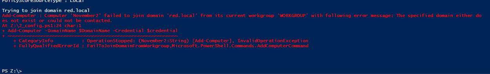
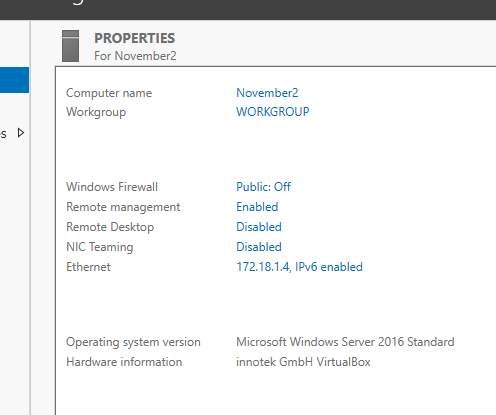
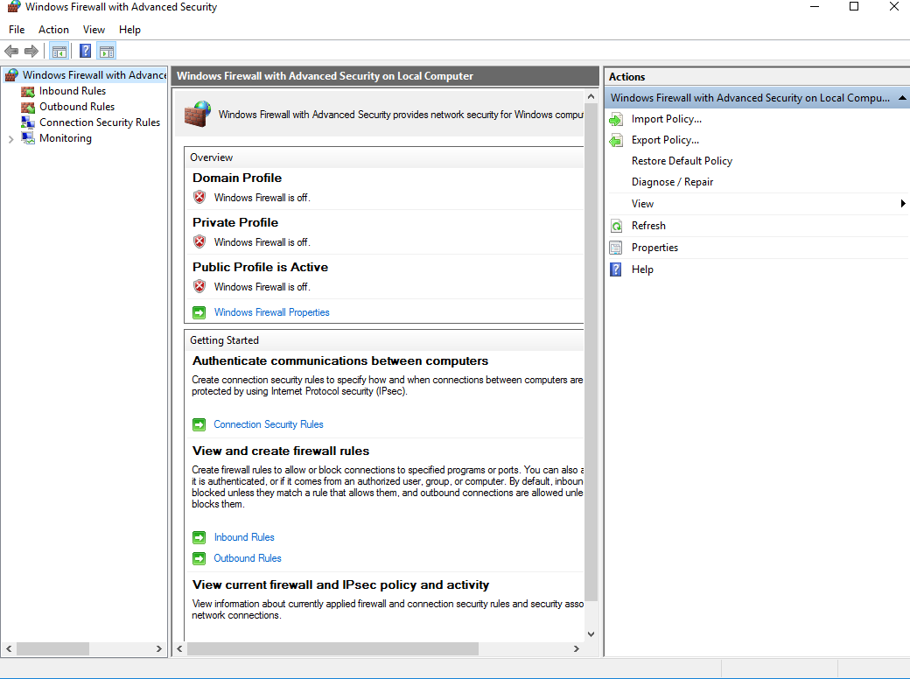
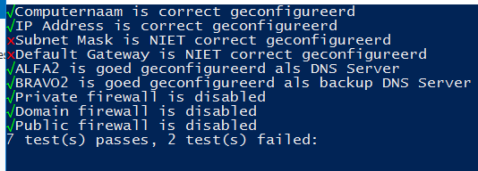

# **Testrapport November2**

Auteurs: Arno Van Nieuwenhove & Levi Goessens

## Testplan

### Resultaten naam server en domein

- Naam van server is aangepast naar "November2" maar domein joinen werkt niet. Dit kan liggen aan het feit dat November2 in een ander subnet zit. Hiervoor de router nodig etc., code ziet er nochtans oké uit voor te kunnen joinen.  

    
  

### Resultaten Netwerksettings
1. Ip-address: 172.18.1.4  
2. Subnet mask: 255.255.255.192 
3. Default Gateway: 172.18.1.7 (Moet dit niet 172.18.1.1 zijn?)
4. Preferred dns: 172.18.1.66
5. Alternate dns: 172.18.1.67 
  
Alternatieve testmethode:  

- Werkt, is OK!   
  
### Resultaten correcte SQL Server Installatie
1.  
2.  
3.  
  
### Resultaten testen firewall

- Firewall staat uit!  
  

## TestConfigNovember2 (powershell)
### Check-name, Check-ip-settings, Check-firewall

  

