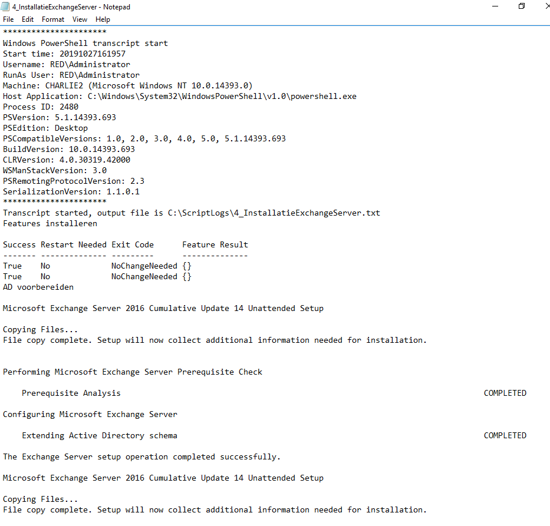
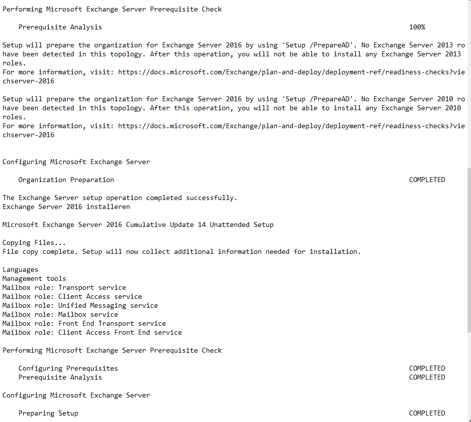
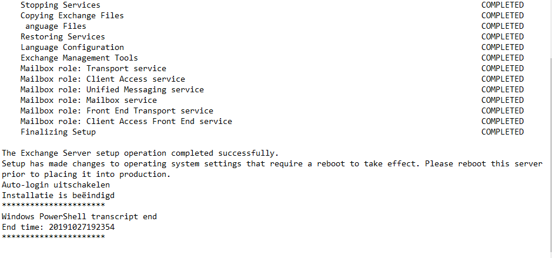
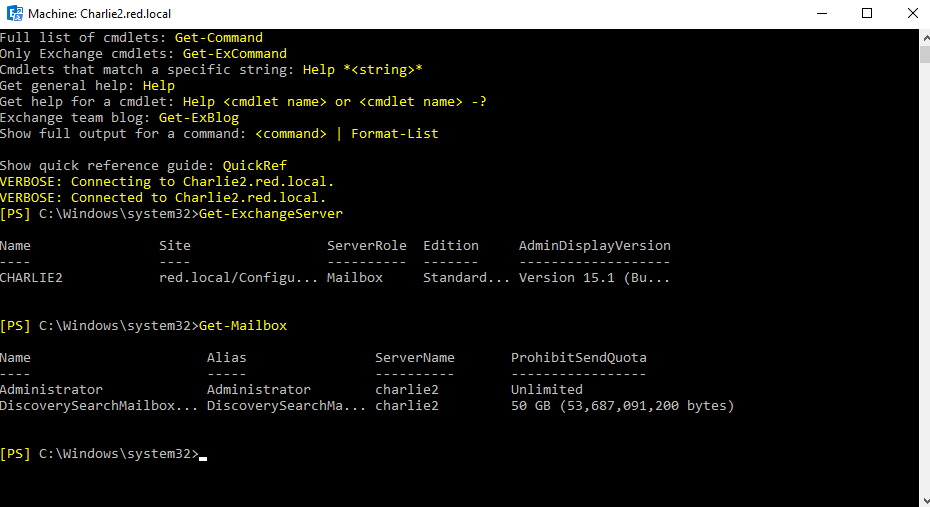

# Testrapport ExchangeServer
## 1: Installeren Windows Server 2016 met de juiste netwerkadapterinstellingen
De Virtuele Machine vervolgens opstarten.

## 2: Download en installatie 'Exchange Server 2016 CU14' op de Virtuele Machine

## 3: Maken van een gedeelde folder in VirtualBox met de bijhorende scripts voor de Exchange Server

## 4: PowershellScript '1_RenameServer.ps1' in de gedeelde schijf 'Z' runnen als administrator

Na uitvoering van alle scripts, is de Exchange Server succesvol geïnstalleerd. De uitvoering van alles scripts hebben net iets meer dan 3 uur geduurd. (6GB RAM meegegeven)

### Resultaat:

#### Uitvoerder test: Joachim Van de Keere
#### Uitgevoerd op: 27/10/2019  
