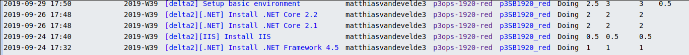

# Voortgangsrapport week 01

Datum voortgangsgesprek: 30/09/2019

## Wat heb je deze week gerealiseerd?

### Algemeen

* Setup basic environment
* Install IIS
* Install .NET Framework 3.5, 4.5 and .NET Core 2.1,2.2
* Research .NET installation and SSL certificate

### Nathan Cammerman
* Informeren opdracht projecten 3
* Info SSL certificatie voor webserver opzoeken
* SSL certificatie implementeren in provisioning script + unzip functie + code cleanup

### Matthias Van De Velde

* Setup basic environment
* Install IIS
* Install .NET Framework 3.5, 4.5 and .NET Core 2.1, 2.2
* Research .NET installation
* Refactoring code

  

## Wat plan je volgende week te doen?

### Algemeen

### Nathan Cammerman

* info web deploy
* info web build
* info SSL + integratie
* info configuring IIS + configuring
### Matthias Van De Velde

* Test plan

## Waar hebben jullie nog problemen mee?

## Feedback technisch luik

### Algemeen

### Nathan Cammerman
### Matthias Van De Velde

## Feedback analyseluik

### Algemeen

### Nathan Cammerman
### Matthias Van De Velde

