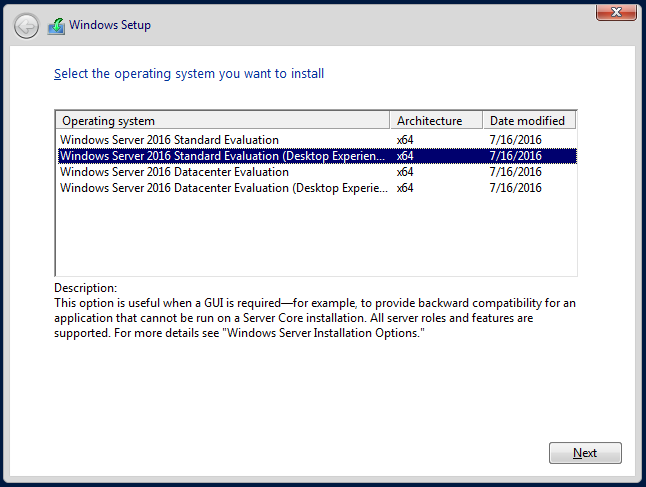
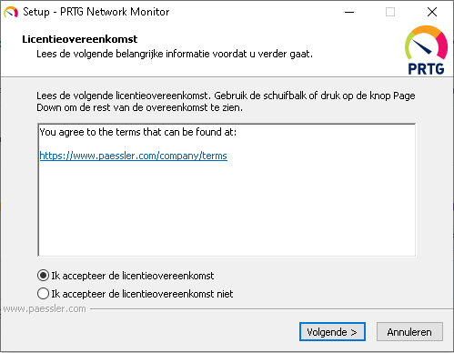
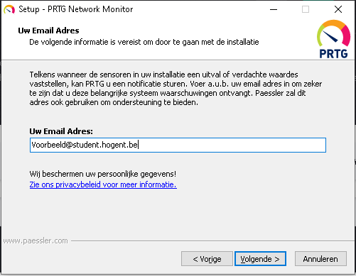
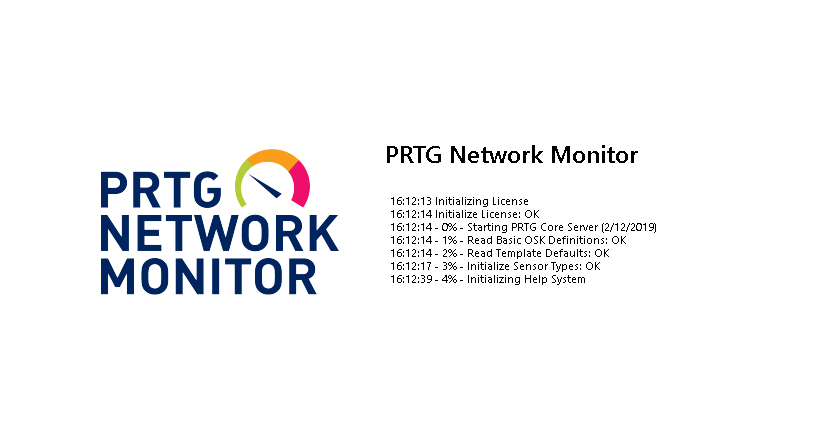
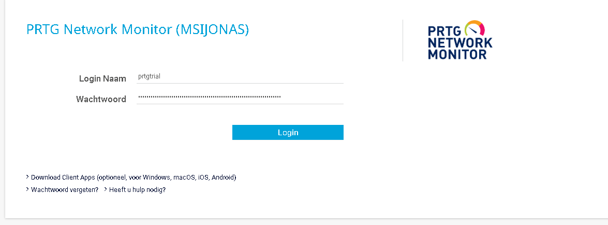
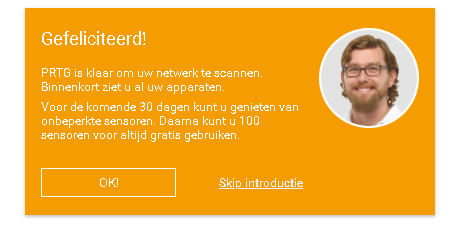
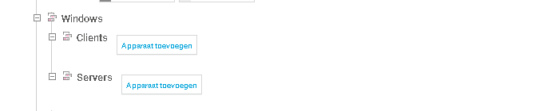
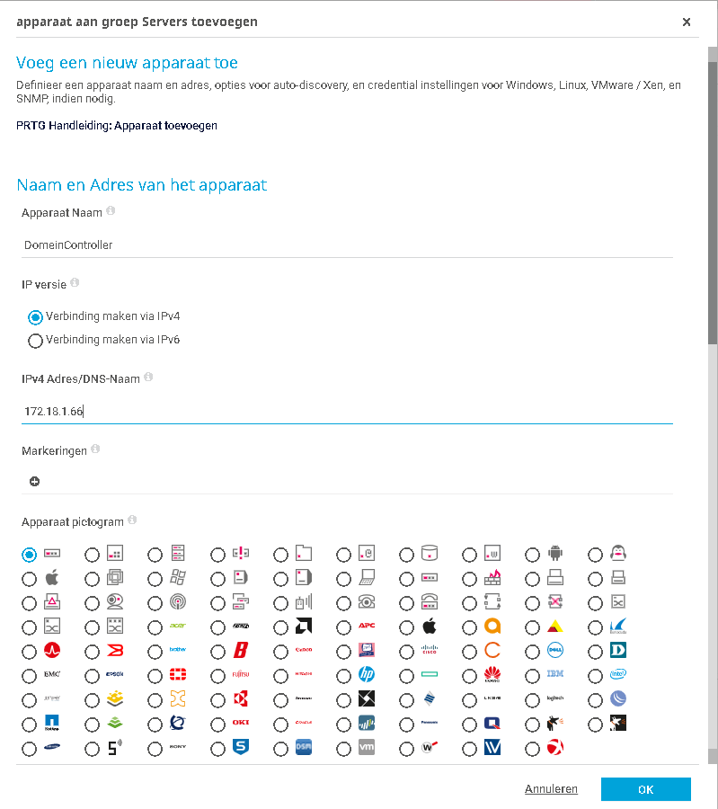
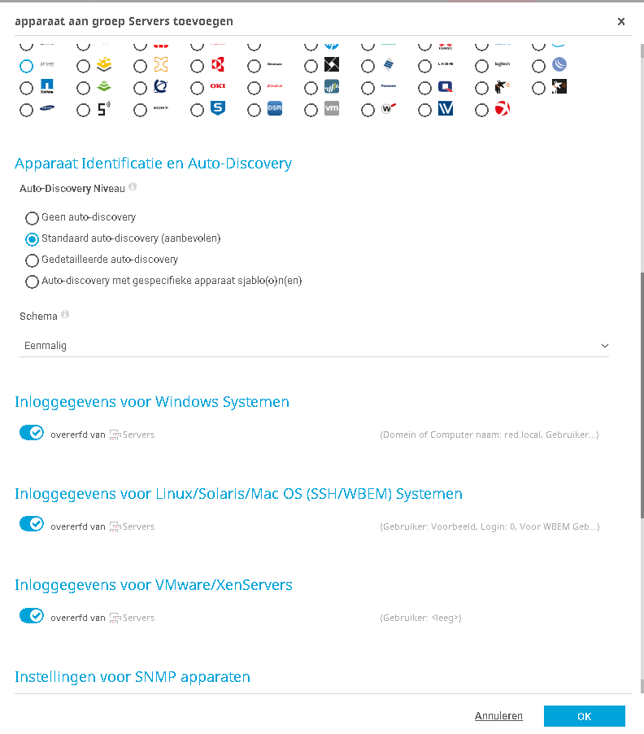

# Technische documentatie

## Nodige software

Om de PRTG server op een correcte mannier te installeren hebben we verschillende programma's nodig:
1. Windows Server 2016 ISO: https://www.microsoft.com/en-us/evalcenter/evaluate-windows-server-2016?filetype=ISO
2. Virtualbox: https://www.virtualbox.org/wiki/Downloads

## Creatie windows server 2016

Open virtualbox en navigeer bovenaan naar `Machine` en klik op `Nieuw...`. Dan krijgt u een wizard te zien zoals in onderstaande schermopname.
Zorg er zeker voor dat uw machine minimum 2gb ram krijgt.

Klik daarna dan op `Aanmaken`. Dan maak je een harde schrijf aan. Minimum 30 gb is nodig voor deze installatie. 

Klik daarna op `Aanmaken`. Nu wordt een virtuele machine aangemaakt. Nu kan u de virtuele machine starten door op de groene knop `Starten` te drukken.

Nu wordt de virtuele machine gestart. Je zal de vraag krijgen om een opstartschijf toe te voegen. Geef het pad op naar de Windows2016 ISO die je hebt gedownload.

Daarna wordt de ISO gestart en krijg je de vraag naar taal en toetsenbord. Vul dit in zoals hieronder.

Geef dan aan dat je de DesktopExperience wil installeren van WindowsServer 2016.

Accepteer de License Terms

Klik op `Custom Install`.

Klik op `Next`

Nu wordt WindowsServer2016 geinstalleerd. Dit kan enkele minuten duren. Je weet dat de installatie gedaan is als je de windows desktop kan zien. Kies een wachtwoord en log in. Nu is het aangeraden om de machine te updaten naar de laatste versie. Herstart de virtuele machine daarna.

## Monitorserver toevoegen aan een bestaand domein

Nu moeten we aan een domein toegevoegd worden. Indien u lokaal bezig bent dan zal u een 2de server moeten aanmaken en die een domeincontroller maken. Ga hiervoor naar de volgende stap. Indien er al een domein is binnen uw netwerk dan kan u zich toevoegen aan dat domein. Geef uw virtuele machine hiervoor eerst het juiste ip-adres. Daarna kunnen we ons toevoegen aan het domein door server manager te open en te navigeren naar `Local Server` en klik op uw computernaam dan zou er een vester moeten openen zoals hieronder.

Klik dan op `Change...` en vul de naam en het domein in.

Vul dan de login gegevens in van uw domein. U kan de volgende stap overslaan.

## Monitorserver toevoegen aan een domein (bestaat nog niet)
Als er nog geen domeincontroller aanwezig is in uw netwerk dan zal je zelf een domeincontroller moeten aanmaken. Hiervoor kan je de documentatie van alpha2 of bravo2 volgen.
Zorg er dan voor dat je monitor server in het zelfde domein zit zoals in de stap hierboven.

## Downloaden PRTG

Ga naar de PRTG website: https://www.paessler.com/prtg?gclid=Cj0KCQiAiZPvBRDZARIsAORkq7dwu92OxGBLzDKYruquO2U--lwIBhPa0AermPf1ir995qyz35Kl5foaAighEALw_wcB
en download PRTG. Start daarna de installer die je juist gedownload hebt en volg de wizard zoals in onderstaande afbeeldingen.

Geef een email-adres op. Dit hoeft niet van hogent te zijn. Je krijgt geen spammails van PRTG. 

Volg de instructies zoals uitgelegd in onderstaande oranje wizard. Deze wizard zal automatische gestart worden als je de eerste keer PRTG opent.

Na het volgen van de wizard bent u klaar met de installatie van PRTG. Nu kan je alle servers uit je verbonden netwerk gaan monitoren. Dit doe je door linksbovenaan naar `apparaten` te gaan en klik dan op `apparaat toevoegen` onder windows-server. Er word weer een wizard geopend. Geef de server die je monitoren een naam en zijn ip-adres. Je kan dan ook een symbool kiezen voor die bepaalde server en klik kan op `standaard auto-discovery` zodat verschillende probes automatisch worden geinstalleerd op de server. Nu zou u na ongeveer 10 minuten moeten zien dat je server succesvol gemonitord wordt. Je kan Cpu-verbruik, Geheugen-verbruik, schijfruimte en nog veel meer zien.

Nu bent u klaar met 1 server en kan je hetzelfde doen voor alle andere servers.