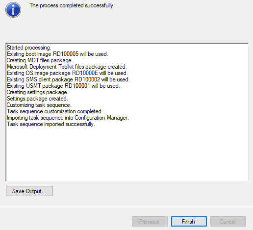

# TECHNISCHE DOCUMENTATIE PAPA2:

## 0. Algemeen + SCCM install Prerequisites:
De scripts van Papa2 zijn zo gemaakt dat je enkel het eerste script (1_RUNFIRST.ps1) moet uitvoeren en dat elk script daarna het volgende script oproept zelfs wanneer de server herstart in het script. Wat de scripts precies doen staat in commentaar stap voor stap uitgelegd bij alle commando’s. Er wordt ook gebruik gemaakt van files die geïnstalleerd worden via de scripts. Deze files staan in: `Papa2/Testomgeving/Scripts/ExtendADschemaBenodigdeFiles/`

### 0.1 Basics (1_RUNFIRST.ps1 script):
Papa2 maakt gebruik van volgend commando om wanneer er (door een actie in het script) een reboot nodig is het volgende script automatisch wordt ingeladen:
`Set-ItemProperty -Path 'HKLM:\Software\Microsoft\Windows\CurrentVersion\RunOnce' -Name ResumeScript `
                -Value "C:\Windows\system32\WindowsPowerShell\v1.0\Powershell.exe -executionpolicy bypass -file `"$VBOXdrive\2_BasicConfig.ps1`""`
Dit commando laadt een "RunOnce" object in de registry met als value het volgende script. Een RunOnce object wordt bij het **eerstvolgende** opstarten van de server automatisch uitgevoerd.

Om dit automatisch te laten werken gebruiken we volgende twee commando's om automatisch in te loggen als administrator (Na installatie van het domein de domain administrator):
`Set-ItemProperty -Path "HKLM:\SOFTWARE\Microsoft\Windows NT\CurrentVersion\Winlogon" -Name DefaultUserName -Value $Username
Set-ItemProperty -Path "HKLM:\SOFTWARE\Microsoft\Windows NT\CurrentVersion\Winlogon" -Name DefaultPassword -Value $Password
Set-ItemProperty -Path "HKLM:\SOFTWARE\Microsoft\Windows NT\CurrentVersion\Winlogon" -Name ForceAutoLogon -Value 1
Set-ItemProperty -Path "HKLM:\SOFTWARE\Microsoft\Windows NT\CurrentVersion\Winlogon" -Name AutoAdminLogon -Value 1`
In de variables $Username en $Password kan je dan de gewenste inlog credentials ingeven.

Alle scripts maken gebruik van logfiles die opgeslaan worden in: `C:\Scriptlogs`
We doen dit door gebruik te maken van het `Start-Transcript` en `Stop-Transcript` commando.

### 0.2 Joining het red.local domein (2_BasicConfig.ps1 script):
In dit script wordt eerst de juiste tijdzone ingesteld en de DNS servers (primair en secundair) ingesteld op Alfa2 en Bravo2.

Daarna gaan we het **red.local** domein joinen met volgend commando:
`Add-Computer -DomainName "red.local"
             -Credential $SCCMcredentials
             -Force:$true
             -Restart`

De -Force:$true option negeert alle prompts voor userinteractie.
De -Restart option forceert een computer reboot zodat de changes applied worden.
-Credential vraagt een credential object die gebruikt wordt om het domain te joinen (moeten credential zijn van de domain admin.)
Dit credential object hebben we voor het `Add-Computer` commando aangemaakt met volgend commando:
`$SCCMcredentials = New-Object System.Management.Automation.PSCredential($Username,$Password)`
Via deze wijze zal je geen prompts krijgen en gebeurd de AD-autorisatie volledig automatisch.

### 0.3 SCCM prerequisites installeren (3_SCCMPrereqInstall.ps1 script):
In ons script hebben we alle nodige files op voorhand gedownload en naar de `Scripts/BenodigdeFiles` directory gekopieerd. Het script zal de files dat nodig zijn voor elke installatie eerst kopiëren naar het bureaublad en de installaties dan allemaal automatisch uitvoeren.

Volgende prerequisites / programma's zijn nodig voordat je SCCM kan installeren (deze worden allemaal geïnstalleerd in het **3_SCCMPrereqInstall.ps1** script):
- ADK 1903 (The Windows Assessment and Deployment Kit)
- ADK WinPE addon (Windows Preinstall Environment)
- MDT 8456 (Microsoft Deployment Toolkit)
- SQL Server (Komt op November2 server)

Wat we ook nodig hebben is een hele lijst Windows Features die je allemaal in 1 commando kan installeren met:
`Install-WindowsFeature -name Web-Server, Web-WebServer, Web-Common-Http, Web-Default-Doc, Web-Static-Content, Web-Metabase, Web-App-Dev, Web-Asp-Net, Web-Http-Logging, Web-Log-Libraries, Web-Request-Monitor, web-health, Web-Http-Tracing, Web-Performance,
Web-Stat-Compression, Web-Security, Web-Filtering, Web-Windows-Auth, Web-Mgmt-Tools, Web-Lgcy-Scripting, Net-Framework-Core, Web-WMI, NET-HTTP-Activation, NET-Non-HTTP-Activ, NET-WCF-HTTP-Activation45, NET-WCF-MSMQ-Activation45, NET-WCF-Pipe-Activation45, NET-WCF-TCP-Activation45, BITS, BITS-IIS-Ext, BITS-Compact-Server, RDC, Web-Asp-Net45, Web-Net-Ext45, Web-Lgcy-Mgmt-Console, Web-Scripting-Tools -source "C:\Users\Administrator\Desktop\DotNet35sources\sxs"`

Opmerking:
De `-source "C:Users\Administrator\Desktop\DotNet35sources\sxs"` option specifieert een bestand dat nodig is om .NET framework 3.5 te installeren. Dit bestand heb ik uit de Windows Server installatie ISO gehaald (uit de sxs directory)

### 0.4 SCCM installatie zelf:
Nog een laatste stap om te doen voor je SCCM kan installeren is de "SCCM required files" dat de installatie normaal download te kopiëren naar het bureaublad. Ik heb deze op voorhand gedownload om de installatie sneller te laten gaan.
`Copy-Item "$VBOXdrive\BenodigdeFiles\SCCMrequiredFiles" -Destination "C:\Users\Administrator\Desktop\SCCMrequiredFiles" -Recurse -verbose`

De installatie van SCCM zelf gebeurt met een .ini file waar alle installatie options in gespecifieerd zijn:
`Start-Process "Setup.exe" -ArgumentList "/script $VBOXdrive\SCCMsilentInstallSettings.ini" -wait`

De uitleg van elke option vind je in het .ini bestand zelf. Alles is goed gedocumenteerd via comments.

### 0.5 SCCM configuratie:
Er zijn enkele belangrijke configuraties in SCCM dat we moeten doen alvorens we de task sequence maken:

#### 0.5.1 Boundary en Boundary groups aanmaken:
`New-CMBoundary -Type ADSite -DisplayName "Active Directory Site" -Value "Default-First-Site-Name"
New-CMBoundaryGroup -Name "ADsite"
Set-CMBoundaryGroup -Name "ADsite" -AddSiteSystemServerName "Papa2.red.local" -DefaultSiteCode "RED"
Add-CMBoundaryToGroup -BoundaryGroupName "ADSite" -BoundaryName "Active Directory Site"
Write-Host "boundaries/groups Creation completed!" -ForeGroundColor "Green"`
In SCCM is een boundary een "ip subnet" die je instelt waarop alle devices komen die je managed. Dit moet je doen om SCCM correct te gebruiken. Daarna wordt er een "boundary group" aangemaakt. Deze boundary group wordt dan gelinkt aan de aangemaakte boundary.

#### 0.5.2 Network Access Account aanmaken:
`New-CMAccount -UserName "$username" -Password $password -SiteCode "RED"
Set-CMSoftwareDistributionComponent -SiteCode "RED" -AddNetworkAccessAccountName "RED\Administrator"`
Met deze commando's wordt er een netwerk access account aangemaakt. De access account is **RED\Administrator**
Daarna wordt de network access account gelinkt aan de SoftwareDistributionRole (= de SCCM role zorgt die PXE boot / client configuratie)

#### 0.5.3 Discovery Methods instellen:
`Set-CMDiscoveryMethod -ActiveDirectoryForestDiscovery -SiteCode "RED" -Enabled $true
Set-CMDiscoveryMethod -NetworkDiscovery -SiteCode "RED" -Enabled $true -NetworkDiscoveryType ToplogyAndClient
Set-CMDiscoveryMethod -ActiveDirectorySystemDiscovery -SiteCode "RED" -Enabled $true -ActiveDirectoryContainer "LDAP://DC=red,DC=local"
Set-CMDiscoveryMethod -ActiveDirectoryUserDiscovery -SiteCode "RED" -Enabled $true -ActiveDirectoryContainer "LDAP://DC=red,DC=local"
$discoveryScope = New-CMADGroupDiscoveryScope -LDAPlocation "LDAP://DC=red,DC=local" -Name "ADdiscoveryScope" -RecursiveSearch $true
Set-CMDiscoveryMethod -ActiveDirectoryGroupDiscovery -SiteCode "RED" -Enabled $true -AddGroupDiscoveryScope $discoveryScope`
Deze commando's stellen de discovery methods in. Of beter gezegd ze zetten alle discovery methods dat SCCM gebruikt aan. Discovery methods zijn nodig om clients te kunnen herkennen wanneer een nieuwe bare-metal client wordt opgestart.

#### 0.5.4 PXE boot configuratie maken:
`Set-CMDistributionPoint -SiteSystemServerName "Papa2.red.local" -enablePXE $true -AllowPxeResponse $true -EnableUnknownComputerSupport $true -RespondToAllNetwork`
Dit commando stelt de PXE correct in (van de distribution point role). Dit commando zorgt ervoor dat SCCM reageert op "onbkende" computers zodat nieuwe clients correct herkent worden. PXE zelf wordt ook aangezet met de `-enablePXE $true` en `AllowPxeRespone $true` options.

### 0.6 WSUS installatie en configuratie:
Om WSUS te gebruiken installeren we eerst en vooral de nodige Windows roles/features:
`Install-WindowsFeature -Name UpdateServices-DB, UpdateServices-Services -IncludeManagementTools`

Daarna wordt WSUS geconfigureerd (Dit zijn de post-deployment installation options):
`.\wsusutil.exe postinstall SQL_INSTANCE_NAME="November2" CONTENT_DIR=C:\WSUS`
Hier wordt ook de link gemaakt met de database op November2 dat WSUS nodig heeft.

Dan wordt er in de SCCM console een SoftwareUpdatePoint role geïnstalleerd. Deze role zorgt voor alles dat met Windows updates te maken heeft:
`Add-CMSoftwareUpdatePoint -SiteCode "RED" -SiteSystemServerName "Papa2.red.local" -ClientConnectionType "Intranet"`

Als laatste stap wordt er ingesteld welke updates er wel of niet nodig zijn (zie 3_SCCMPrereqInstall.ps1 script want dit zijn heel wat commando's). Deze commando's stellen simpelweg in dat we enkel de "english language" updates nodig hebben en welke soort updates we willen. Hierna Wordt een WSUS synchronisatie gestart om de updates te synchroniseren van de Microsoft servers.

## 1. Voorbereiden op task sequence:

### 1.1 Aanmaken van de nodige netwerklocaties
    De Task Sequence Wizard gebruikt enkel bestandlocaties op een netwerkpad, en niet op een lokaal pad.  
#### 1.1.1   Aanmaken van de gedeelde map
1.  Maak op de C schijf een Map "TSReq" aan
2.  Rechtermuisklik op TSReq
3.  Ga naar properties
4.  Ga naar de tab "Sharing"
5.  Klik op "Share"
6.  Controleer of de permissies er uit zien als onderstaande afbeelding  

7.  Klik op "Share"
8.  Controleer of het pad naar de map "\\\\papa2\TSReq" is
9.  Klik nu op "Done"  

Je kan controleren of deze map correct is aangemaakt door in File Explorer het pad "\\\\papa2" in te voeren.
#### 1.1.2   Aanmaken van de benodigde mappen (Maak deze in de gedeelde folder "TSReq")
    De bestanden "install.wim" en de 4 ".msi"'s kan je vinden op het bureablad.  
1. "MDT Toolkit Package": LEEG  
2. "MDT Settings Package": LEEG  
3. "installImage": MET "install.wim"
4. "Applicaties": MET:  
    - Acrobat Reader msi  
	- Flash Player msi  
	- Java (jre) msi  
	- LibreOffice msi  

### 1.2 install.wim toevoegen in SCCM
    Op deze manier heb je het benodigde installatiebestand   
    dat in de Task Sequence Wizard word gebruikt al klaar staan om in de Wizard te selecteren.

##### In Configuration Manager Console:  
1. Navigeer links onder naar "Software Library"
2. Selecteer "Operating Systems"
3. Right-Click "Operating System Images" -> "Add O S Image"
4. Navigeer naar "\\\\TSReq\installImage\install.wim" SELECTEER "install.wim" -> NEXT
5. TAB General: NEXT
6. TAB Summary: NEXT  

# 2. Aanmaken van de Task Sequence
    Een Task Sequence bevat de volgorde aan stappen en processen die moeten worden uitgevoerd bij
    het deployen ervan.
    Het geeft de doel-pc een lijst van installaties en configuraties die dan worden uitgevoerd om
    zo de computer gebruiksklaar te maken zonder al deze stappen manueel te moeten uitvoeren.
    In dit geval is dit vooral handig om de nodige applicaties te installeren
    en het AD Domain te joinen (stap 4).

1. In "Software Library"
    - ga naar"Operating Systems"  
    - right-click "Task Sequences"  
    - SELECTEER "Create MDT Task Sequence"  

2. SELECTEER "Client Task Sequence"  
    - Next
3. Geef NAAM  
    - Next (=Tab "Details")
4. Selecteer "Join a Domain"  
    - vul "red.local" in bij Domain
5. Set Account:  
    - User Name="red\Administrator"  
    - Password="Admin2019"  
    - Confirm password
    - OK
6. Windows Settings:  
    - User Name="RED IT"  
    - Org. Name="HoGent"
7. Administrator Account:  
    - SELECTEER "ENABLE"  
    - Password="Admin2019"  
    - Confirm  
    - NEXT

8. Capture Settings:  
    - DEFAULT= NEVER  
    - NEXT
9. Specify Existing Boot Image:  
    - Browse naar "...x64"  
    - OK  
    - NEXT
10. MDT Package:
	- SELECTEER "Create new MDT Toolkit Files Package"
	- Geef pad op naar de UNC Map bv "\\\\papa2\TSReq\MDT Toolkit Package"
	- NEXT
11. MDT Details:
	- Name="MDT Toolkit Package"
	- NEXT
12. OS IMAGE:
	- Specify an Existing OS image: SELECTEER "Windows 10 Enterprise Evaluation"
	- NEXT
13. DEPLOYMENT METHOD:
	- SELECTEER "Perform a USER DRIVEN Installation"
	- NEXT
14. CLIENT PACKAGE:
	- SPECIFY -> Browse -> "Micr. Corp. Config. Man. Client Pack." -> OK
	- NEXT
15. USMT PACKAGE:
	- SPECIFY -> Browse -> "Micr. Corp. User State Migr. Tool for Windows 10.0....." -> OK
	- NEXT
16. SETTINGS PACKAGE:
	- SELECTEER "Create new settings Package"
	- VUL UNC PAD IN bv: "\\\\papa2\TSReq\MDT Settings Package"
	- NEXT
17. SETTINGS DETAILS:
	- NAME="MDT Settings Package"
	- NEXT
18. SYSPREP PACKAGE:
	- No Sysprep Package is Required
	- NEXT
19. SUMMARY:  
  
    ("dc3" wordt vervangen door "papa2")
	- NEXT  

	- WACHTEN  

	- FINISH  

# Task Sequence Aanpassen
## 3. APPLICATIES TOEVOEGEN AAN SCCM
    Dit is nodig om de applicaties in de Task Sequence te kunnen toevoegen.  
    Aan de command voor de silent install (installatie op de achtergrond) voegen we het volgende toe:  
        - "/norestart" hierdoor zal de computer niet automatisch herstarten  
         indien dit nodig is om de installatie te voltooien.  
        - Van "/q" maken we "/qn", hierdoor zal er geen interface worden weergegeven.
1. Navigeer in de Configuration Manager naar "Software Library"
2. SELECTEER "Application Management"
3. RIGHT-CLICK "Applications"
4. SELECTEER "Create Application"  

5. Browse naar UNC Pad "\\\\papa2\TSReq\Applicaties\_.msi"  
  
("dc3" wordt vervangen door "papa2")
6. NEXT -> NEXT
7. BIJ "Installation Program":
    - maak van "/q" -> "/qn"
    - voeg "/norestart" toe op EINDE  

8. BIJ "Install Behavior": SELECTEER "Install for System"
9. NEXT -> NEXT -> CLOSE  

## HERHAAL VOOR ALLE 4 DE APPLICATIES  
# 4. Aanpassen van de Task Sequence
## 4.1 Uitschakelen van "Auto Apply Drivers"  
    Hierdoor verloopt de remote installatie sneller.  
    Aangezien de client-pc in deze context niet echt zal worden gebruikt, zijn drivers overbodig.
1. RIGHT-CLICK de gemaakte TASK SEQUENCE
2. SELECTEER "Edit"  

3. Navigeer naar "Post Install"
4. SELECTEER "Auto Apply Drivers"
5. TAB "OPTIONS" -> SELECTEER "Disable This Step"  

6. Klik op "Apply"

## 4.2 Toevoegen van de Applicaties aan de Task Sequence  
    Hierdoor worden de installaties van de applicaties opgenomen in het stappenplan van de SCCM Deployment.
1. RIGHT-CLICK de gemaakte TASK SEQUENCE
2. SELECTEER "Edit"  

3. Navigeer naar "STATE RESTORE"  
4. Navigeer hierbinnen naar "INSTALL APPLICATIONS"
5. SELECTEER "Install Application"  

6. SELECTEER "Install the following Applications"
7. KLIK op STER  

8. VINK de 4 Applicaties AAN

9. Klik op OK
10. CONTROLEER of ONDERSTE PROPERTY is AANGEVINKT (IF 1 FAILS, CONTINUE WITH OTHER)  

11. APPLY
12. OK

# BRONNEN
# Opzetten server stap voor stap
[Opzetten Server 1](https://www.virtualizationhowto.com/2019/05/create-unattend-answer-file-for-windows-server-2019-automated-packer-installation/)
[Opzetten Server 2](https://sheska.com/how-to-create-an-automated-install-for-windows-server-2019/)

# autounattend.xml
[AutoAttend XML 1](https://github.com/ruzickap/packer-templates/tree/master/http/windows-2019)
[AutoAttend XML 2](https://github.com/joefitzgerald/packer-windows/tree/master/answer_files/2016)
[AutoAttend XML 3](https://win10.guru/simple-deployment-with-autounattend-xml-answer-file/)

# ADK installeren
[ADK Installeren](https://docs.microsoft.com/en-us/windows-hardware/get-started/adk-offline-install)

# Opstarten server youtube videos
[Opstarten Server1](https://www.youtube.com/watch?v=n90Kli9u4CM)
[Opstarten Server2](https://www.youtube.com/watch?v=pEwn0BoMz4U)

[Heeft SCCM WDS nodig?](https://social.technet.microsoft.com/Forums/systemcenter/en-US/95cff00c-198a-43a4-b6e4-1807ff7aeae7/does-sccm-require-wds?forum=configmgrgeneral)
[SCCM install met .ini file](https://skatterbrainz.wordpress.com/2016/02/03/sccm-1511-command-line-installation-via-powershell/)
[SCCM install complete guide](https://www.manishbangia.com/sccm-guide-series/)
[Deploying clients met SCCM](https://docs.microsoft.com/en-us/windows/deployment/windows-10-poc-sc-config-mgr)
[Installshield silent install options (voor MSI files)](https://www.itninja.com/static/090770319967727eb89b428d77dcac07.pdf)
[WSUS met powershell](https://devblogs.microsoft.com/scripting/installing-wsus-on-windows-server-2012/)
[WSUS sync process](https://codeandkeep.com/PowerShell-Sccm-Configure-SUP/)
[Win10 client deployment 1](https://docs.microsoft.com/nl-nl/configmgr/osd/deploy-use/install-new-windows-version-new-computer-bare-metal)
[Win10 client deployment 2](https://docs.microsoft.com/nl-nl/configmgr/osd/plan-design/infrastructure-requirements-for-operating-system-deployment)
[Boot images](https://www.prajwaldesai.com/how-to-create-boot-image-using-mdt-for-sccm/)
