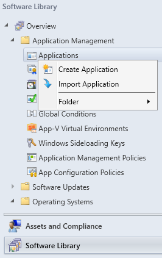
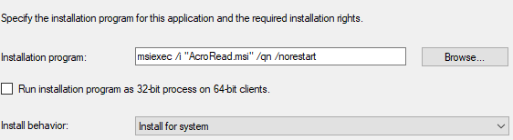
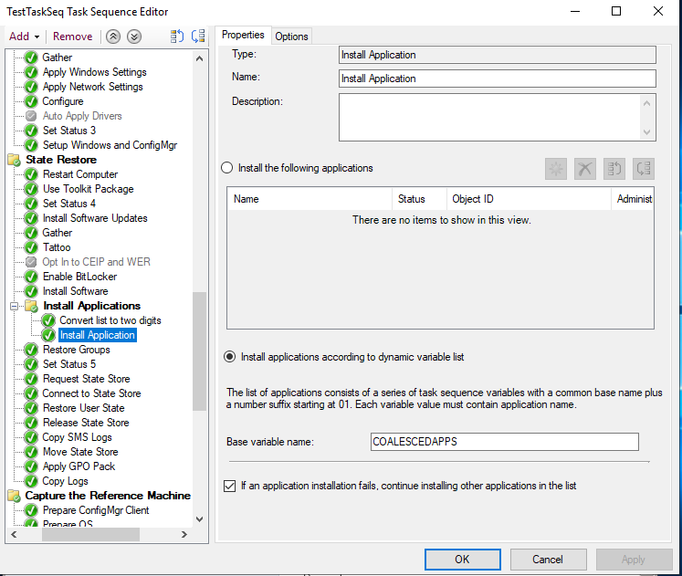
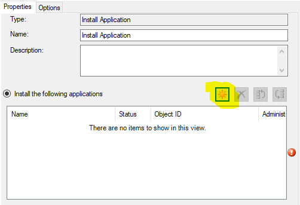
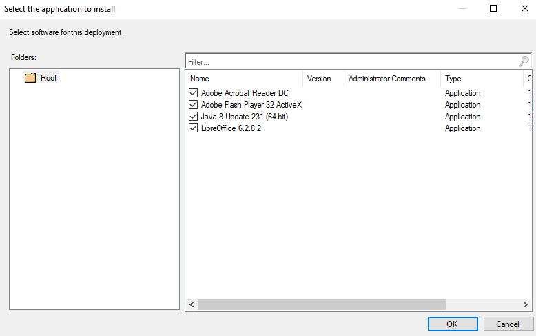
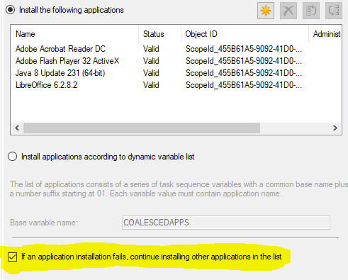

# Task Sequence Aanpassen
## 1. APPLICATIES TOEVOEGEN AAN SCCM
    Dit is nodig om de applicaties in de Task Sequence te kunnen toevoegen.  
    Aan de command voor de silent install (installatie op de achtergrond) voegen we het volgende toe:  
        - "/norestart" hierdoor zal de computer niet automatisch herstarten  
         indien dit nodig is om de installatie te voltooien.  
        - Van "/q" maken we "/qn", hierdoor zal er geen interface worden weergegeven.
1. Navigeer in de Configuration Manager naar "Software Library"
2. SELECTEER "Application Management"
3. RIGHT-CLICK "Applications"
4. SELECTEER "Create Application"  

5. Browse naar UNC Pad "\\\\papa2\TSReq\Applicaties\\_.msi"  
  
("dc3" wordt vervangen door "papa2")
6. NEXT -> NEXT
7. BIJ "Installation Program": 
    - maak van "/q" -> "/qn"
    - voeg "/norestart" toe op EINDE  

8. BIJ "Install Behavior": SELECTEER "Install for System"
9. NEXT -> NEXT -> CLOSE  

## HERHAAL VOOR ALLE 4 DE APPLICATIES  
# 2. Aanpassen van de Task Sequence
## 2.1 Uitschakelen van "Auto Apply Drivers"  
    Hierdoor verloopt de remote installatie sneller.  
    Aangezien de client-pc in deze context niet echt zal worden gebruikt, zijn drivers overbodig.
1. RIGHT-CLICK de gemaakte TASK SEQUENCE
2. SELECTEER "Edit"  

3. Navigeer naar "Post Install"
4. SELECTEER "Auto Apply Drivers"
5. TAB "OPTIONS" -> SELECTEER "Disable This Step"  

6. Klik op "Apply"

## 2.2 Toevoegen van de Applicaties aan de Task Sequence  
    Hierdoor worden de installaties van de applicaties opgenomen in het stappenplan van de SCCM Deployment.
1. RIGHT-CLICK de gemaakte TASK SEQUENCE
2. SELECTEER "Edit"  

3. Navigeer naar "STATE RESTORE"  
4. Navigeer hierbinnen naar "INSTALL APPLICATIONS"
5. SELECTEER "Install Application"  

6. SELECTEER "Install the following Applications"
7. KLIK op STER  

8. VINK de 4 Applicaties AAN

9. Klik op OK
10. CONTROLEER of ONDERSTE PROPERTY is AANGEVINKT (IF 1 FAILS, CONTINUE WITH OTHER)  

11. APPLY
12. OK

