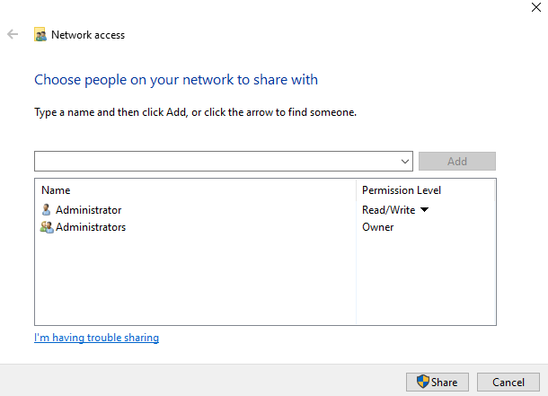
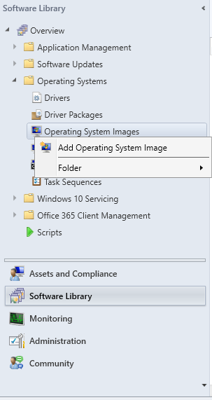

# Stappenplan voor het aanmaken van een Task Sequence in SCCM.

# 1. Prerequisites

## 1.1 MDT integreren in SCCM
    Door MDT te integreren in SCCM kan je je Task Sequence veel meer personaliseren.
    Ook zorgt dit ervoor dat de nood aan scripting verminderd, je toegang hebt tot alle MDT variabelen,
    MDT databases, toolkit en customsettings.ini. 
    Op deze manier maak je het dus eenvoudiger om een Task Sequence aan te maken met specifieke vereisten, 
    zonder deze via scripts te moeten uitvoeren.
    
- Zoek in "START" "Configure ConfigMgr Integration" op en Start dit programma.
- NEXT  
- FINISH
 
## 1.2 Aanmaken van de nodige netwerklocaties
    De Task Sequence Wizard gebruikt enkel bestandlocaties op een netwerkpad, en niet op een lokaal pad.  
### 1.2.1   Aanmaken van de gedeelde map
1.  Maak op de C schijf een Map "TSReq" aan
2.  Rechtermuisklik op TSReq
3.  Ga naar properties
4.  Ga naar de tab "Sharing"
5.  Klik op "Share"
6.  Controleer of de permissies er uit zien als onderstaande afbeelding  

7.  Klik op "Share"
8.  Controleer of het pad naar de map "\\\\papa2\TSReq" is
9.  Klik nu op "Done"  

Je kan controleren of deze map correct is aangemaakt door in File Explorer het pad "\\\\papa2" in te voeren.
### 1.2.2   Aanmaken van de benodigde mappen (Maak deze in de gedeelde folder "TSReq")
1. "MDT Toolkit Package": LEEG  
2. "MDT Settings Package": LEEG  
3. "installImage": MET "install.wim"
4. "Applicaties": MET:  
    - Acrobat Reader msi  
	- Flash Player msi  
	- Java (jre) msi  
	- LibreOffice msi  

## 1.3 install.wim toevoegen in SCCM 
    Op deze manier heb je het benodigde installatiebestand   
    dat in de Task Sequence Wizard word gebruikt al klaar staan om in de Wizard te selecteren.

#### In Configuration Manager Console:  
1. Navigeer links onder naar "Software Library"
2. Selecteer "Operating Systems"
3. Right-Click "Operating System Images" -> "Add O S Image"
4. Navigeer naar "\\\\TSReq\installImage\install.wim" SELECTEER "install.wim" -> NEXT
5. TAB General: NEXT
6. TAB Summary: NEXT  

# 2. Aanmaken van de Task Sequence
    Een Task Sequence bevat de volgorde aan stappen en processen die moeten worden uitgevoerd bij 
    het deployen ervan. 
    Het geeft de doel-pc een lijst van installaties en configuraties die dan worden uitgevoerd om
    zo de computer gebruiksklaar te maken zonder al deze stappen manueel te moeten uitvoeren.
    In dit geval is dit vooral handig om de nodige applicaties te installeren
    en het AD Domain te joinen (stap 4).

1. In "Software Library"
    - ga naar"Operating Systems"  
    - right-click "Task Sequences"  
    - SELECTEER "Create MDT Task Sequence"  

2. SELECTEER "Client Task Sequence"  
    - Next
3. Geef NAAM  
    - Next (=Tab "Details")
4. Selecteer "Join a Domain"  
    - vul "red.local" in bij Domain
5. Set Account:  
    - User Name="red\Administrator"  
    - Password="Admin2019"  
    - Confirm password
    - OK
6. Windows Settings:  
    - User Name="RED IT"  
    - Org. Name="HoGent"
7. Administrator Account:  
    - SELECTEER "ENABLE"  
    - Password="Admin2019"  
    - Confirm  
    - NEXT

8. Capture Settings:  
    - DEFAULT= NEVER  
    - NEXT
9. Specify Existing Boot Image:  
    - Browse naar "...x64"  
    - OK  
    - NEXT
10. MDT Package:
	- SELECTEER "Create new MDT Toolkit Files Package"
	- Geef pad op naar de UNC Map bv "\\\\papa2\TSReq\MDT Toolkit Package"
	- NEXT
11. MDT Details:
	- Name="MDT Toolkit Package"
	- NEXT
12. OS IMAGE:
	- Specify an Existing OS image: SELECTEER "Windows 10 Enterprise Evaluation"
	- NEXT
13. DEPLOYMENT METHOD:
	- SELECTEER "Perform a USER DRIVEN Installation"
	- NEXT
14. CLIENT PACKAGE:
	- SPECIFY -> Browse -> "Micr. Corp. Config. Man. Client Pack." -> OK
	- NEXT
15. USMT PACKAGE:
	- SPECIFY -> Browse -> "Micr. Corp. User State Migr. Tool for Windows 10.0....." -> OK
	- NEXT
16. SETTINGS PACKAGE:
	- SELECTEER "Create new settings Package"
	- VUL UNC PAD IN bv: "\\\\papa2\TSReq\MDT Settings Package"
	- NEXT
17. SETTINGS DETAILS:
	- NAME="MDT Settings Package"
	- NEXT
18. SYSPREP PACKAGE:
	- No Sysprep Package is Required
	- NEXT
19. SUMMARY:  
  
    ("dc3" wordt vervangen door "papa2")
	- NEXT  

	- WACHTEN  

	- FINISH
