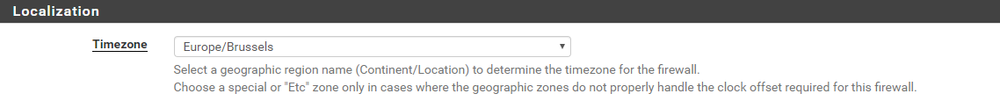
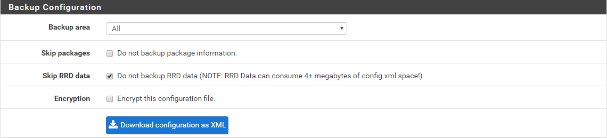

# Documentatie Configuratie PfSense: 
### Inhoudsopgave
1. [Intro](#Intro)  
2. [Algemene configuratie](#Algemeen)  
3. [Vlans](#Vlan)  
4. [Firewall](#Firewall)  
   4.1. [Aliases](#Alias)  
   4.2. [Firewall Regels](#Rules)  
5. [Automatisatie](#Automatisatie)
6. [Routering](#Routering)
7. [Bronnen](#Bronnen)  
 
## 1. Intro   
Voor we beginnen met het configureren van deze firewall moeten we eerst weten hoe PfSense werkt en wat we precies willen doen met PfSense.  

PfSense is een [Stateful](https://en.wikipedia.org/wiki/Stateful_firewall) firewall. Bij default zal PfSense al het verkeer tegenhouden die door de WAN interface gaat. Dit betekent dat als er bijvoorbeeld verkeer komt van een ander netwerk of het internet door de firewall, zal PfSense deze packets bij default tegenhouden door een impliciete firewall regel op de WAN interface.  

Als je host systeem bijvoorbeeld op de LAN bevindt en naar google.com gaat, controleert PfSense de LAN interface regels en staat het verkeer toe door de default LAN regels. Het creëert dan een staat. Een staat is wat de firewall vertelt wat er aan de hand is met elke verbinding die met succes tot stand is gebracht. De firewall houdt ze allemaal bij in een statustabel.  

Bij elke status onthoudt de firewall een hoop informatie over die verbinding. Het weet dat een bepaalde PC verbinding heeft gemaakt met  website google.com door een bepaalde poort. Als PfSense vervolgens een antwoord van google.com ontvangt zal PfSense dit verkeer toelaten naar de PC. Staten duren niet te lang en zullen vervallen nadat ze inactief zijn.

  

In dit project heeft onze firewall de volgende taken:
* zulu2 bevindt zich tussen VLANs 600 en 700.
* OS: De meest recente stabiele versie van PFSense.
* Deze Firewall heeft NAT uitgeschakeld! NAT is actief op de router Router1.
* Configureer deze firewall zodanig dat enkel die poorten openstaan die echtnodig zijn binnen uw netwerk.
* Configureer deze firewall zodanig dat je vanuit elk subnet van je netwerk/LAN(zowel de VLANs als de router subnets) kan communiceren met het internet.

*In de volgende secties zullen we PfSense stap voor stap configureren zodat het elke taak wordt gerealiseerd.*

## 2. Algemene configuatie   
Voor we beginnen met de echte doelfunctionaliteit in te stellen van PfSense gaan we eerst zorgen dat de benaming, timezone, routering,.. enzovoort van de firewall goed is ingesteld. We beginnen met de benaming en timezone, vergeet niet op save te klikken na elke wijziging.

* Navigeer naar System -> General Setup  
   * Hostname: Zulu2
   * Domain: red.local  
   
    
  
* Zet de timezone in naar Brussel.  
   * Timezone: Europe/Brussels  
   
    
  
Nu moeten we nog de router "Router1" toevoegen als default gateway voor onze firewall.
 
 * Navigeer naar System -> Routing  
   * Klik op Add
   * Gateway: 172.18.1.105 
   * Description: Router1  
   
      
    
Het admin account gebruik nog steeds het default passwoord "pfsense", we gaan dit ook veranderen.

 * Navigeer naar System -> User Manager  
   * Klik op Edit User van admin (Potlood)
   * Password: Admin2019  

We moeten outbound NAT uitschakelen omdat dit de taak is van Router1.

* Navigeer naar Firewall -> NAT  
  * Klik op de Outbound tab
  * Vink Disable Outbound NAT rule generation aan
  
        
   
We gaan DHCP requests relayen naar de DHCP server in ons domein. (zorg dat DHCP server uit staat)

* Navigeer naar Services -> DHCP Relay  
  * Vink Enable DHCP relay on interface aan  
  * Kies LAN interface  
  * Destination Server: 172.18.1.1  
  
    
  
## 3. Vlans   
We gaan 2 Vlans "600" en "700" toevoegen aan de firewall.  

* Navigeer naar Interfaces -> Assignments  
   * Ga naar de VLans tab
   * Klik op Add
   * Parent Interface: Wan
   * Vlan Tag: 700  
   
Nu moeten we hetzelfde doen voor LAN interface.  

   * Klik op Add
   * Parent Interface: Lan
   * Vlan Tag: 600  
   
     
   
We moeten deze interfaces nog manueel toevoegen.

 * Ga naar de Interface Assignments tab
 * Klik 2 keer op Add  
 
    
  

## 4. Firewall   
We moeten onze firewall instellen zodanig dat de juiste (niet alle!) poorten openstaan van servers in VLAN 500 zodat andere netwerken ermee kunnen communiceren. Deze servers zijn: alfa2 (Domeincontroller met DNS), bravo2 (2de Domeincontroller en DNS), charlie2 (mailserver) en delta2 (webserver).  

  

### 4.1 Aliases 
Voor we regels toevoegen aan de firewall, gaan we Ip's en poorten groeperen om het ons gemakkelijker te maken. We zullen zo in het totaal veel minder regels moeten toevoegen. We gaan eerst Ip's van de Domeincontrollers groeperen, en dan groeperen we de poorten.

* Navigeer naar Firewall -> Aliases  
   * Klik op Add  
   * Name: Domeincontrollers  
   * Ip: 172.18.1.66 (alpha2)  
   * Ip: 172.18.1.67 (bravo2)  
   
     
   
Nu gaan we alle poorten toevoegen die we nodig hebben en deze groeperen. Hier is een lijst van alle [poorten](https://support.microsoft.com/en-us/help/832017/service-overview-and-network-port-requirements-for-windows) die worden gebruikt voor windows servers.

   * Klik op de Ports tab
   * Voeg de aliases toe met dezelfde values als onderstaande afbeelding  

     
   
Nu kunnen we naar de firewall regels gemakkelijker instellen.  
      
### 4.2 Firewall Regels 
Omdat PfSense een [Stateful](https://en.wikipedia.org/wiki/Stateful_firewall) moeten we alleen regels toevoegen aan de WAN interface. Andere netwerken kunnen kunnen initiëel communiceren met specifieke poorten en hosts die wij zullen bepalen.  

* Navigeer naar Firewall -> Rules
* Voeg één voor één de regels toe aan de Wan interface met dezelfde values als onderstaande afbeelding.  

  

PfSense is nu volledig configurereerd en is klaar voor de productieomgeving, we moeten alleen nog de interface namen en LAN ip veranderen in de productieomgeving zelf.  
 
## 5. Automatisatie   
Om het hele installatie en configuratie process te versnellen is het nodig om zoveel mogelijk te automatiseren. Voor PfSense bestaan er ook Vagrant boxes, maar omdat deze boxes outdated zijn en het niet zo practisch is om met vagrant in productieomgeving te werken gaan we gewoon met de ISO file werken. Het manueel installeren van PfSense duurt niet lang, alleen het configureren kan veel tijd in beslag nemen. Voor de configuratie van PfSense te automatiseren bestaat er een tool op de WebGUI die ons kan helpen. PfSense kan namelijk een XML bestand lezen (of opslaan) waarin alle configuratie staat en deze uitvoeren op het systeem, dit zullen we nu proberen.  

We maken een backup te maken van de configuratie.  

* Navigeer naar Diagnostics -> Backup & Restore  
   * Backup Area: All  
   * Download configuration as XML  
   
  

We laden een custom configuratie.  

* Navigeer naar Diagnostics -> Backup & Restore  
   * Restore Area: All  
   * Configuration File: Zulu2 (XML file voor productieomgeving)  
   * Restore Configuration  
      
     

## 6. Routering   

Omdat onze routers tussen 2 routers bevind, moeten we ook doen aan routering. Wij kiezen ervoor om statische routes toe te voegen in plaats van dynamische routering te gebruiken. Dit komt omdat OSPF de routing tables niet wil bijhouden bij pfsense in de productie. Het is ook veel meer werk om dynamische routering in te zetten omdat we dan ook de package manager moeten updaten en dus direct internet connectie nodig hebben in de productieomgeving.  

* Navigeer naar System -> Routing  
* Navigeer naar Static Routes tab  
* Voeg één voor één de static routes toe volgens de onderstaand afbeelding    

 

## 7. Bronnen   
<http://pfsensesetup.com/ip-spoofing-and-defenses/>  
<https://docs.netgate.com/pfsense/en/latest/nat/index.html>  
<https://docs.netgate.com/pfsense/en/latest/book/config/pfsense-xml-configuration-file.html>  
<https://docs.netgate.com/pfsense/en/latest/config/manually-editing-the-pfsense-configuration.html>  
<https://docs.netgate.com/pfsense/en/latest/usermanager/locked-out-of-the-webgui.html>  
<https://nguvu.org/pfsense/pfsense-baseline-setup/>  
<https://docs.netgate.com/pfsense/en/latest/book/firewall/firewall-fundamentals.html>  
<https://support.microsoft.com/en-us/help/832017/service-overview-and-network-port-requirements-for-windows>  
