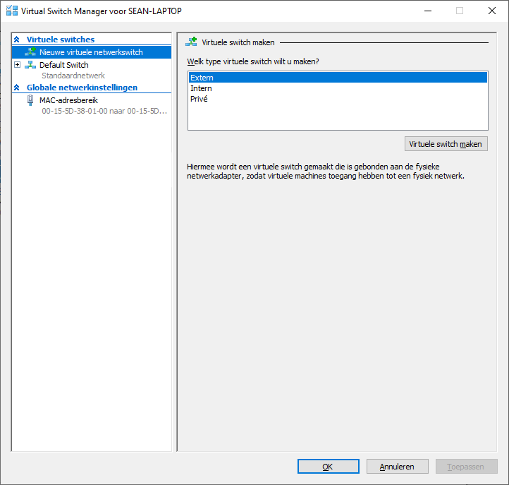
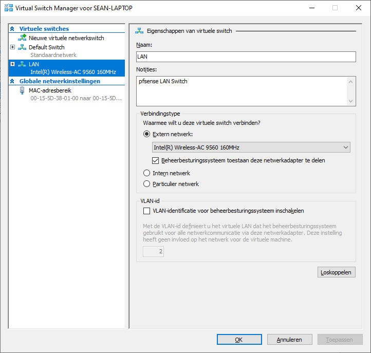
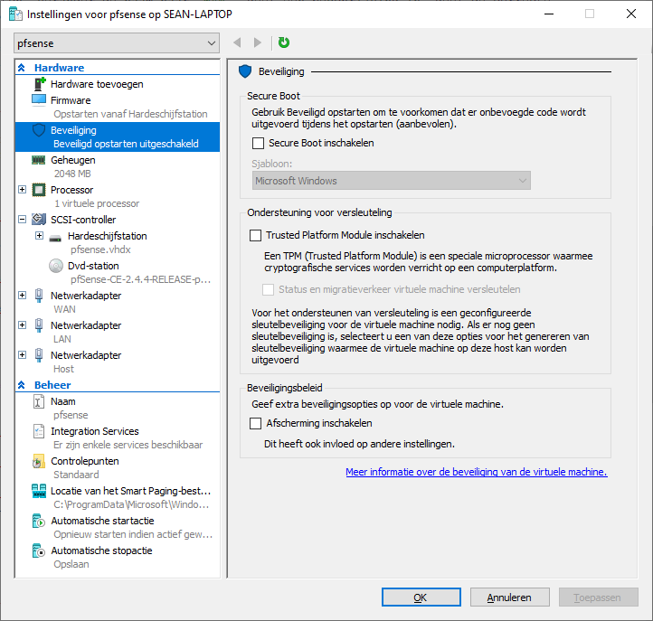
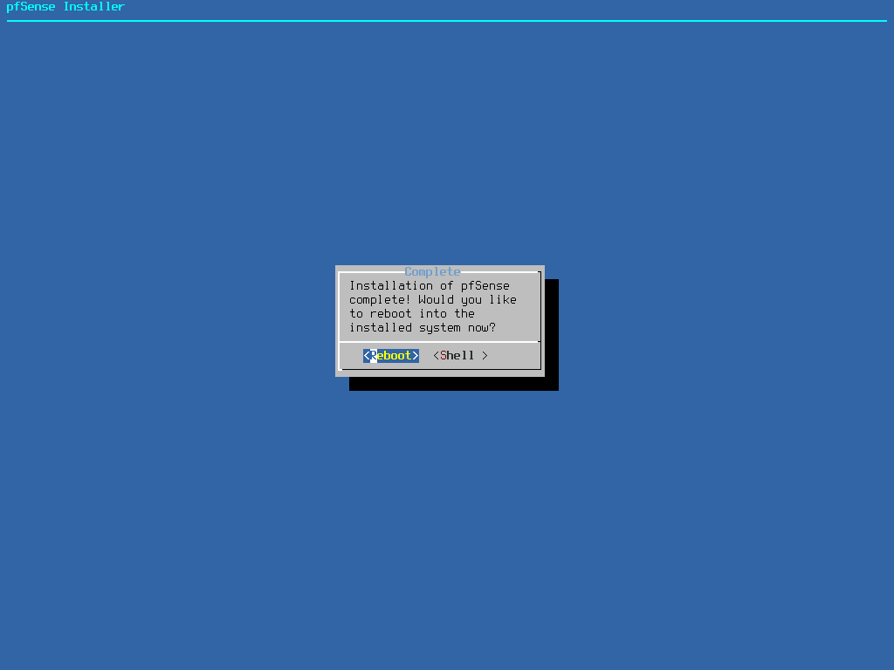
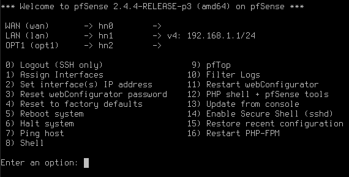

# Documentatie Installatie met Virtualbox en HyperV: 
### Inhoudsopgave
1. [AchtergrondInformatie](#AchtergrondInformatie)  
2. [Installatie](#Installatie)  
3. [VirtualBox](#Virtualbox)  
4. [Hyper-V](#Hyper-V)  
   1. [Aanmaken Virtuele Switches](#Switch)  
   2. [Aanmaken Virtuele Machine](#Machine)  
   3. [Configuratie Virtuele Machine](#CMachine)  
   4. [Installatie pfsense](#InstallatieP)
   5. [Wijzigen Hyper-V LAN Adapter Host (Optioneel)](#Adapter)
5. [Initiële Configuratie](#Config)  
6. [Webconfig](#Webconfig)
7. [Bronnen](#Bronnen)  
 
## 1. AchtergrondInformatie   
 
PfSense is een open source firewall die draait op FreeBSD, een OS gebaseerd op UNIX. De software staat wereldwijd bekend omdat het heel gebruiksvriendelijk en gratis is. Pfsense kan ook gebruik worden als DHCP of DNS server, we kunnen na de installatie nog extra packages installeren in de shell.  
We kunnen PfSense laten werken op een PC of VM. De configuratie gebeurd op de shell zelf of via een web-interface. In deze documentatie gaan we gebruik maken van VirtualBox (testomgeving) om de installatiestappen gemakkelijk uit te leggen.
In de productie omgeving moeten we echter hyperV gebruiken maar dit duurt een beetje langer.
Automatie is deels mogelijk door een voorgeconfigureerd XML bestand te laden in de installatie of een XML bestand in de WebGUI te laden na de Installatie. Door de vlotte installatie dat PfSense voorziet gaan we niet gebruik maken van een vagrant box.

## 2. Installatie   

- Downloaden ISO file  
    1. Ga naar de download page van [PfSense](https://www.pfsense.org/download/).  
    2. Kies:  
	   Architecture > AMD64(64-bit)  
       Installer > CD Image(ISO) Installer  
       Mirror > Frankfurt, Germany  
    3. Download (664mb)  
	

## 3. VirtualBox   

- Create FreeBSD Virtual Machine
   1. Type > BSD , Version > FreeBSD(64bit), Default settings  
   2. Settings > Network:  
      Adapter 1 > Bridged Adapter  
	  Adapter 2 > Internal Network (maak een nieuw netwerk genaamd "pfsense")  
	  In het testplan gaan we een "Host-Only" adapter gebruiken voor Adapter 2 zodat we via onze PC in de WebGUI kunnen.
   
   3. Mount disk > pfSense-CE-2.4.4-RELEASE-p3-amd64.iso    
   4. Start VM > Doe de Installatie > Reboot en Unmount de ISO file  

PfSense staat nu op de hardeschijf met de [Defaultconfiguration](https://docs.netgate.com/pfsense/en/latest/install/installing-pfsense.html#pfsense-default-configuration).  
We moeten nu de firewall verder configureren via de shell menu of de WebGUI.

## 4. Hyper-V   

Deze handleiding veronderstelt dat Hyper-V ingeschakelt is op het hostsysteem. Indien dit niet het geval is open een Powershell-venster met administratorprivileges, voer het volgende commando uit, en herstart hierna het hostsysteem:

`Enable-WindowsOptionalFeature -Online -FeatureName Microsoft-Hyper-V -All`

### 4.1 Aanmaken Virtuele Switches   

 1. Start het Hyper-V beheerscherm op.
 2. Navigeer naar **Actie > Virtual Switch Manager...**
 3. Navigeer naar **Nieuwe virtuele netwerkswitch**, kies als type **Extern**, en bevestig met **Virtuele switch maken**. Indien je de Hyper-V omgeving wil testen via je lokale host kies dan als type **Intern** zoals in de afbeelding hieronder:
 
 4. Navigeer naar deze nieuwe toegevoegde switch, verander de naam naar `LAN`, geef een beschrijving in, geef de correcte netwerkadapter voor het LAN-netwerk in indien je voor een **Extern** type hebt gekozen, en pas de wijzigingen toe.
 
 
 
 5. Voeg opnieuw een nieuwe netwerkswitch toe zoals in **3.**, kies deze keer als type **Extern**.
 6. Navigeer naar deze nieuwe toegevoegde switch, verander de naam naar `WAN`, geef een beschrijving in, geef de correcte netwerkadapter voor het WAN-netwerk in, en pas de wijzigingen toe.
 
 
### 4.2 Aanmaken Virtuele Machine   

 1. Navigeer naar **Actie > Nieuw > Virtuele machine...** in het Hyper-V beheerscherm.
 2. Geef een naam in voor de nieuwe virtuele machine en ga door.
 
 3. Selecteer de optie **Generatie 2** en ga door.
 
 4. Geef `2048 MB` in als opstartgeheugen, sta **dynamische geheugen** toe, en ga door.
 
 5. Geef als verbinding **WAN** in en ga door.
 
 6. Selecteer de optie **Een virtuele harde schijf maken**, geef `20 GB` geheugen in, en ga door.
 
 7. Selecteer de optie **Een besturingssysteem installeren vanaf een opstartbaar installatiekopiebestand**, navigeer naar het **pfsense ISO-bestand**, en ga door.
 
 8. Voltooi de installatie.
 
### 4.4 Configuratie Virtuele Machine   

 1. Navigeer naar de **Instellingen** van de nieuwe virtuele machine.
 2. Navigeer naar **Hardware toevoegen**, selecteer de optie **Netwerkadaptor**, en bevestig met **Toevoegen**.
 
 3. Navigeer naar de nieuwe netwerkadapter, selecteer als virtuele switch **LAN**, en pas de wijzigingen toe.
 
 4. Navigeer naar **Firmware** en rangschik de opstartvolgorde als volgt: *Hardeschijfstation > Dvd-station > WAN > LAN*. Pas de wijzigingen toe.
 
 5. Navigeer naar **Beveiliging**, schakel **Secure Boot** uit, en pas de wijzigingen toe.
 
 
### 4.5 Installatie pfsense   

 1. Verbind met de virtuele machine via **Actie > Verbindinging maken...** en **Start** de virtuele machine.
 2. Wacht terwijl de virtuele machine opstart van de ISO.
 
 3. **Accepteer** de copyrightnotitie.
 
 4. Selecteer de optie **Install**.
 
 5. Ga door met de **default keymap**.
 
 6. Selecteer de optie **Auto (UFS)**.
 
 7. Wacht tot de installatie compleet is en selecteer **No**.
 
 8. Selecteer **Reboot** en wacht tot de virtuele machine heropstart.
 
 9. Werp het ISO-installatiebestand uit via **Media > Dvd-station > ISO uitwerpen**.
 
 10. Wanneer gevraagd wordt om de VLANs op te zetten weiger door `n` in te geven en bevestig met enter.
 
 11. Waneer gevraagd wordt om de interfaces in te geven, geef `hn0` in voor **WAN**, `hn1` in voor **LAN**, en bevestig nadien met `y`. Bevestig steeds met enter.
 

  
 

 12. Wacht tot de installatie van pfsense compleet is en het hoofdmenu van pfsense wordt weergegeven. Je kan nu beginnen met de pfsense-configuratie.
 
 
 
### 4.6 Wijzigen Hyper-V LAN Adapter Host (Optioneel) <a name="Adapter">

Deze stap is enkel nodig indien je als LAN-switch type **Intern** gekozen hebt voor lokaal testen, zodat je de *pfsense Web GUI* via het LAN-netwerk kan bereiken vanop de host.
 1. Navigeer op het hostsysteem naar het tabblad **Netwerkverbinding** van het **Configuratiescherm.** Men kan dit ook vinden via **Alle Instellingen** > **Netwerk en Internet** > **Status** > **Adapteropties wijzigen.**
 2. Rechtsklik op de **Hyper-V LAN Switch** en kies **Eigenschappen.**
 3. Ga op het tabblad **Netwerken** naar de optie **Internet protocol versie 4 (TCP/IPv4)** in de lijst en selecteer **Eigenschappen.**
 4. Indien nodig selecteer de optie **Het volgend IP-adres gebruiken** om een statisch IP toe te wijzen. Geef als IP-adres een adres in dat in hetzelfde subnet ligt als het LAN IP-adres dat de pfsense VM in de vorige stap heeft weergegeven (in mijn geval 192.168.1.1/24), alsook hetzelfde subnetmasker. De standaardgateway, alsook DNS-serveradressen, mogen worden leegelaten. Bevestig met **Ok** en **Sluiten.**

  

 
Je kan nu vanop de host de pfsense Web GUI via het LAN-adres bereiken.

## 5. Initiële Configuratie   
Na de installatie zien we dit menu:  
  
We kunnen vanaf hier al extra packages installeren of commands invoeren via de shell (12) of andere devices pingen binnen het netwerk (7).
Het eerste wat we willen doen is de interfaces juist instellen (Ip addressen en VLans).
Druk Ctrl + C in om de configuratie te eindigen en terug naar het menu te gaan.  
- Lan Ipv4 address instellen  
 1. Druk 2 in voor "Assign Interfaces" en enter  
 2. Kies Lan interface en geef het Ipv4 address in met subnet mask (192.168.1.55/24 in mijn test omgeving)  
 3. Blijft enter drukken en "n" voor DHCP server  
 
 Als je het juist gedaan hebt zal je het volgend scherm zien kan je via een browser op de Webconfig gaan.  
     
 
 
 
## 6. Webconfig   
Maak een nieuwe VM aan dat toegang heeft tot een webbrowsers en dat in het zelfde netwerk ligt als de firewall.  
- Toegang tot WebGUI  
  1. Settings > Network:  
     Adapter 1 > Internal Network    
     Name > pfsense  
  2. Stel Ipv4 address van VM in op hetzelfde netwerk als dat van de firewall (192.168.1.54/24 in mijn test omgeving)   
  3. Zet Web Security uit en surf naar het ip address van de firewall (192.168.1.50).  
  Je zou normaal het login scherm zien van de PfSense WebGUI.  
    
 Log in "admin" en passwoord "pfsense" en ga door de wizard, alle gegevens dat je nu ingeeft kan je later nog veranderen. Na de wizard    zal je komen op het dashboard waar je een overzicht ziet van het systeeminformatie van de firewall. Van hieruit kan je alle configuratie doen dat je firewall nodig heeft.  
    
       

## 7. Bronnen   
<https://bertvv.github.io/notes-to-self/2015/09/29/virtualbox-networking-an-overview/>
<https://docs.netgate.com/pfsense/en/latest/install/installing-pfsense.html>  
<https://docs.netgate.com/pfsense/en/latest/virtualization/virtualizing-pfsense-with-hyper-v.html>  
<https://samuraihacks.com/install-pfsense-in-virtualbox/>  
<https://www.ceos3c.com/pfsense/pfsense-2-4-installation-step-step-overview/>  
<https://www.youtube.com/watch?v=h97J70hzcP0>  
<https://www.youtube.com/watch?v=6s5wvmlESfo>  
<https://www.pfsense.org/getting-started/>  
<https://docs.netgate.com/pfsense/en/latest/packages/package-list.html>  
<https://www.youtube.com/watch?v=KOuCy8mf214> 
<https://docs.microsoft.com/en-us/virtualization/hyper-v-on-windows/quick-start/enable-hyper-v>  
<https://www.pbworks.net/windows-10-hyper-v-vm-boot-not-working/>  
