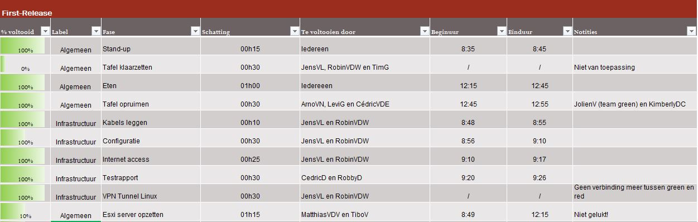
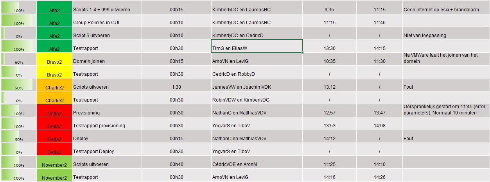
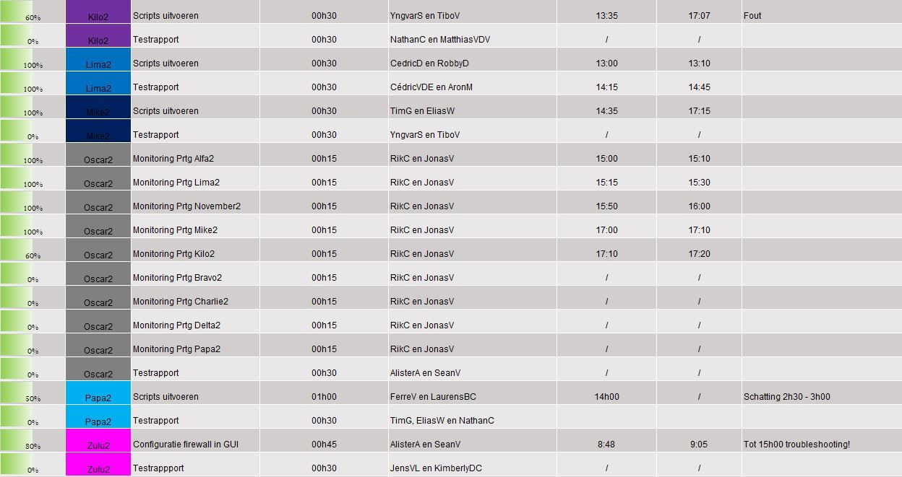
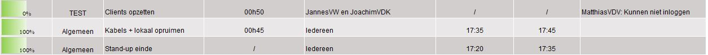

# Retrospectieve Team Red 

## Wat ging goed?
- Goede planning, tijds- en taakverdeling
- Goede organisatie
- Overzichtelijk werken
- Iedereen heeft snel hulp gekregen, teamwork
- Communicatie tussen Aalst en Gent verliep goed
- Iedereen was op tijd aanwezig
- Netwerk heeft het probleem opgelost met virtualbox (bridged adapter) -> maar host-only adapters zie je niet meer

## Wat ging minder goed?
- Meer testen op voorhand, troubleshooten
- Esxi-server op voorhand niet getest en werkte niet (enkel Alfa2 en Bravo2)
- Bij Firewall was het op voorhand niet duidelijk dat er gerouteerd moest worden. Dit moest op de productie zelf nog gebeuren.
- Firewall: Op de first-release zelf met het netwerk testen, waardoor er nog problemen waren met OSPF 
- Netwerkproblemen
- Sneller bepalen van software en beter bespreken
- Na een bepaalde tijd deed iedereen wat hij/zij wou
- Tijd op de post-its klopte niet (door probleem met esxi-server)
- November2 zou eerder moeten afgewerkt worden, was niet klaar voor de first-release
- Linux had geen tijd, waardoor netwerk niet kon integreren
- Linux heeft de kabels van Windows uitgetrokken en heeft dit niet met Windows gecommuniceerd
- Mike2: Error met IIS Server (opgelost na kabels opnieuw instoppen)

## Wat heb je geleerd?
- Communicatie onderhouden
- Op voorhand testen, integratietesten op voorhand. Testing is zeer belangrijk.
- Dingen die noodzakelijker zijn, zouden eerder moeten afgewerkt worden
- Wanneer iets niet werkt, beslissing rapper nemen. Hiervoor zou een korte stand-up moeten gehouden worden om deze beslissing te nemen. Oplossingen zoeken in team na een groot probleem
- Voor de esxi-server: JOLIET = wanneer je iets in het iso-bestand zet, behoudt dit de naam
- Oscar2: Installatie van prtg moet na het domein joinen geïnstalleerd worden
- Firewall: Oplossing = statische routering
- Op release met alles op hetzelfde netwerk zetten -> VLAN's

## Waar heb je nog problemen mee?
- Testplannen en testrapporten stonden niet allemaal op de release-branch -> Iedereen zou slack op voorhand moeten lezen
- Volgens Delta2: November2 blijkt niet te werken voor Delta2. 
- Volgens November2: November2 werkt maar Delta2 zit met probleem
- Netwerk - Linux
- Lima2: Shadowcopy
- Bravo2 werkte op de first-release op de esxi-server, maar niet met bridget adapter. Dit werkt nu wel volledig.
- Bij Kilo2 was het moeilijk om de DHCP-server te autoriseren. Kilo2 kon geen clients in een ander VLAN een IP geven
- Zulu2 kon OSPF niet gebruiken
- Charlie2: probleem met PrepareADSchema
- Alfa2: Clients 

## Hoe moeten we de problemen oplossen?
- Esxi-server: 2 weken testen of het lukt met de VLAN's op de ESXI-server 
- Netwerk: Statische routes toevoegen voor Zulu2; ACL's toevoegen
- Netwerk: VPN -> Linux (afwachten op Linux)
- Clients: Kunnen nooit inloggen op een domeincontroller. GPO "Allow log on locally" instellen op domeincontroller. 
- Charlie2: PrepareADScheme
- Delta2: Deploy
- Iemand die de planning in het oog houdt
- Laatste startmoment op de post-its vermelden
- Post-it overzichtelijker verdelen (horizontale en verticale lijnen) 

## Best practices:
### Windows
- Gebruik van een duidelijk kanban-bord is nuttig
- Communicatie is belangrijk (tussen windows-linux zijn netwerkers hiervoor verantwoordelijk)

### Linux
- Wij hebben op ons kanbanbord iedere servers een aparte rij gegeven.
- Iedereen heeft spontaan geholpen bij elkaar, bij andere servers,...
- Wij hebben 3 stand-ups gedaan (in het begin, midden en nadien) => Leerkracht raadt aan om er nog meer te doen op 'cruciale momenten', niet pas om de 3u.

## Teamevaluatie
- Netwerk + services als geheel
  - [ ] Bekwaam: Er waren fouten, maar het grotere geheel werkte. 
- Troubleshooting
  - [ ] Bekwaam: Er werd een grondige aanpak gevolgd, maar we hebben geen troubleshooting rapporten gemaakt. 
- Technische documentatie
  - [ ] Gevorderd: De documentatie werd voor elke server opgesteld.     

## Kanban-bord First-Release
  
  
  
  
