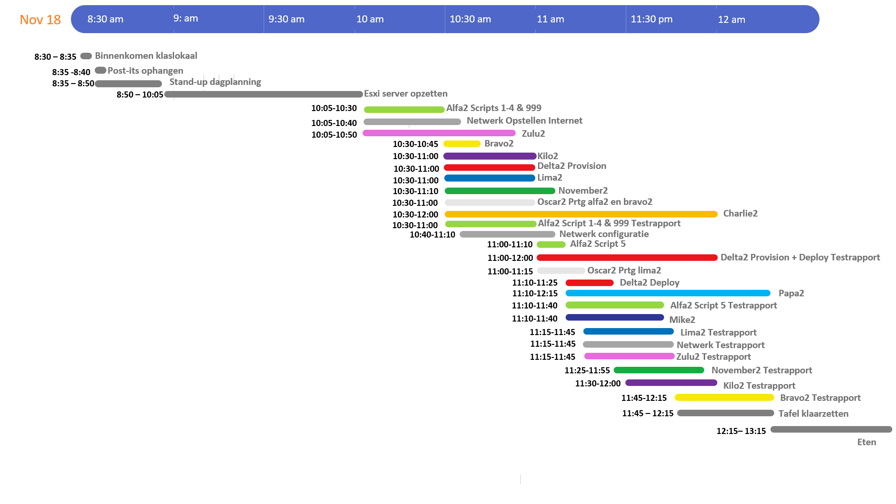
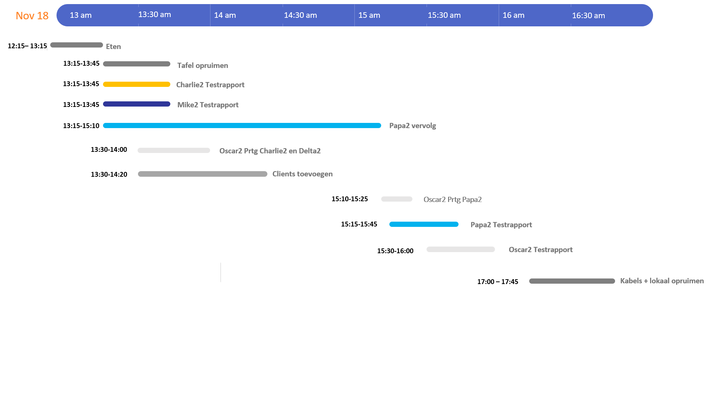
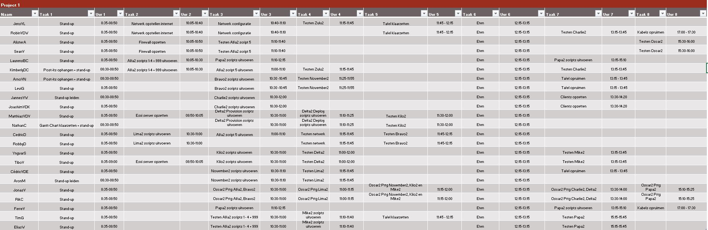

# Verslag week 9

## Aanwezigen week 9:
| Naam                          | Aanwezig |
| :---                          | :---   |
| Alister Adutwum               | V |
| Laurens Blancquart-Cassaer    | V |
| Nathan Cammerman              | V |
| Rik Claeyssens                | V |
| Kimberly De Clercq            | V |
| Tim Grijp                     | V |
| Yngvar Samyn                  | V |
| Joachim Van de Keere          | V |
| Matthias Van de Velde         | V |
| Robin Van de Walle            | V |
| Jens Van Liefferinge          | V |
| Jannes Van Wonterghem         | V |
| Sean Vancompernolle           | V |
| Jonas Vandegehuchte           | V |
| Tibo Vanhercke                | V |
| Ferre Verstichelen            | V |
| Elias Waterschoot             | V |
| Robby Daelman                 | V |
| Cedric Detemmerman            | V |
| Levi Goessens                 | V |
| Aron Marckx                   | V |
| Cédric Van den Eede           | V |
| Arno Van Nieuwenhove          | V |

## Algemeen

- Iedereen vertelt wat hij in week 7 en 8 uitgevoerd heeft.
- Overlopen dag aan de hand van Gantt-chart
  
  
- Takenverdeling
  
- Productieomgeving: VMWare Workstation
  - Gegevens om in te loggen op ESXI server:
    - Servernaam: 172.22.2.4
    - username: root
    - ww: Esxtest1
    - Ook ip-adres host instellen in zelfde netwerk met default gateway 172.22.2.1
- Post-its 
  - Elke server heeft dezelfde kleur alsop het Trello-bord
  - Telkens uur `start` en `einde` zelf opschrijven
  - Telkens verplaatsen
  - Er zijn ook post-its met iedereen zijn naam, dit dient om uw naam onder 'beschikbare personen' te kleven wanneer u vrij bent. 
  
    - [ ] Tussen [ ] staat de server aangegeven
    - [ ] Het cijfer in de rechterbovenhoek toont de prioriteit
    - [ ] 'E' staat voor Estimated, de schatting
    - [ ] Bij 'start' vul je dus de tijd in wanneer je aan deze taak begint. Bv. `08:50`. Dan kleef je deze post-it onder "doing".
    - [ ] Bij 'einde' vul je dus de tijd in wanneer je deze taak beëindigt. Bv. `09:00`. Dan kleef je deze post-it onder "testing". 
    - [ ] Linksonderaan zie je de namen van de personen die deze taak zullen uitvoeren. 

- Problemen/Vragen?

## Gerealiseerd week 7 en week 8
* Alfa
  * Post-its
* Bravo 
  * Testrapport gemaakt van Lima2 en November2
* Charlie 
  * Delta getest + testplan aangepast voor test-release + algemeen wat zagen.
* Delta 
  * Kilo2 getest + planning test-release
* Kilo 
  * Mike2 getest
* Lima 
  * Scripts afgewerkt + 
* Mike 
  * Oscar2 getest
* November 
  * Alles werkt, maar volgens papa werkt het niet met
* Oscar 
  * Documentatie aagepast + netwerk getest
* Papa 
  * Papa afgewerkt + documentatie
* Zulu 
  * Configuratie aangepast + hebben nog adapter nodig
* Netwerkinfrastructuur 
  * Alle configuratie werkt

## Stand-up achteraf

* Alfa
  * Er kan niet ingelogd worden met de user-accounts. Geen idee hoe het moet opgelost worden
* Bravo
  * Server werkte op ESXI, maar niet meer op laptops
  * Gaat thuis op VM's proberen
* Charlie
  * Afwachten. 15 min
* Delta
  * Eerste deel werkt volledig. Deploy werkt niet.
  * Gaat eens horen bij file server want bij hen werkt het
* Kilo
  * Test-script werkt, maar praktijk niet 
* Lima
  * Zo goed als af. Configuratie moet nog afgewerkt worden
* Mike
  * sharepoint werkt en webapplicatie ook => Succesvol
* November
  * Top
* Oscar
  * Alles gelukt
* Papa
  * Probleem met link met SQL
  * Er moet iets extra worden toegevoegd aan 
* Zulu
  * problemen met ospf, maar workaround via static routes
  * Achteraf mogelijke oplossing voor ospf gevonden. Volgende week testen.
* Netwerkinfra
  * Alles lukte
  * Hebben achteraf static routes moeten toevoegen voor zulu

## Volgende stand-up:
- Retrospective

© Author - Kimberly De Clercq en Jannes Van Wonterghem
